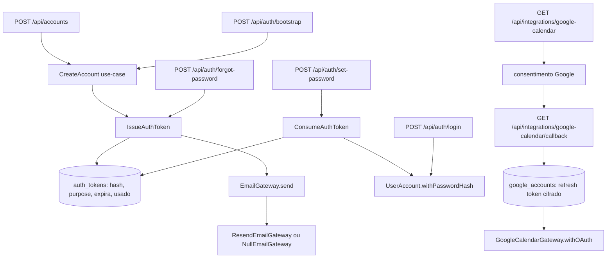

# Autenticação Nativa — Design

**Spec**: `.specs/features/autenticacao-nativa/spec.md`
**Status**: Approved

---

## Architecture Overview

Três blocos novos e uma remoção. O bloco de e-mail e o bloco de token são portas de aplicação com implementação de infraestrutura (mesmo molde do `MessagingGateway`/`MetaWhatsAppGateway` já existentes). O bloco de Calendar move a obtenção da credencial OAuth do callback de login para uma rota de integração própria. A remoção apaga o caminho de login por Google e a senha mestre.



---

## Code Reuse Analysis

### Existing Components to Leverage

| Component | Location | How to Use |
| --- | --- | --- |
| `MessagingGateway` + `NullMessagingGateway` | `src/application/ports/messaging-gateway.ts` | Molde literal da porta de e-mail: `enabled` + método de envio + implementação nula que loga |
| `MetaWhatsAppGateway` | `src/infrastructure/messaging/meta-whatsapp-gateway.ts` | Molde da implementação real: `fetch` + `AbortSignal.timeout` + `configFromEnv()` que devolve `null` sem credenciais |
| `hashPassword` / `verifyPassword` | `src/lib/auth/password.ts` | Reaproveitados sem alteração pelo `set-password` e pelo login |
| `encryptSecret` / `decryptSecret` | `src/lib/auth/crypto.ts` | Reaproveitados sem alteração pelo fluxo de Calendar |
| `RateLimiter` + `clientIp` | `src/lib/auth/rate-limit.ts`, `client-ip.ts` | Limite de 5/min já usado no login, reaplicado em `forgot-password` e `bootstrap` |
| `createOAuthClient` | `src/lib/auth/google-oauth-client.ts` | Reaproveitado pelo fluxo de Calendar (aceita `{clientId, clientSecret, redirectUri}`) |
| `UserAccount.withPasswordHash` | `src/domain/auth/user-account.ts` | Já existe e valida o formato `scrypt$` — usado pelo `set-password` |
| `CreateAccount` | `src/application/auth/create-account.ts` | Reaproveitado pelo bootstrap com um ator sintético `super_admin` |
| `withTenant` | `src/infrastructure/persistence/drizzle/tenant-scope.ts` | Não se aplica: `auth_tokens` é indexado por conta, e o fluxo de convite/reset é pré-sessão (sem `clinicId` de contexto) — ver Risks |
| `route-guard-conformance.test.ts` | `tests/api/route-guard-conformance.test.ts` | Estendido (não recriado) com a checagem estrutural de ausência de `api/auth/google` |
| `GoogleCalendarGateway.withOAuth` | `src/infrastructure/calendar/google-calendar-gateway.ts` | Inalterado; passa a receber a config do novo módulo de OAuth de Calendar |

### Integration Points

| System | Integration Method |
| --- | --- |
| `container.ts` | Ganha `email: EmailGateway` e `authTokens: AuthTokenRepository` em `Services`; `oauthCalendarGateway` passa a ler `googleCalendarOAuthConfigFromEnv()` em vez de `googleOAuthConfigFromEnv()` |
| `access-policy.ts` | `PUBLIC_PATHS` ganha as 3 rotas públicas novas; `isAuthUsable()` passa a checar só `AUTH_SECRET` |
| `route-family.ts` | `/api/integrations` entra em `ADMINISTRATIVE_PREFIXES` (conectar a agenda da clínica é ato administrativo) |
| Drizzle | Migração `0023_auth-tokens.sql` cria `auth_tokens`; nenhuma tabela existente muda |
| E2E | `global-setup.ts` troca o login por senha mestre por bootstrap + convite consumido em processo |

---

## Components

### `EmailGateway` (porta)

- **Purpose**: enviar um e-mail transacional, com uma implementação nula para ambiente sem credenciais.
- **Location**: `src/application/ports/email-gateway.ts`
- **Interfaces**:
  - `readonly enabled: boolean`
  - `send(message: EmailMessage): Promise<void>` — `EmailMessage = { to: string; subject: string; text: string }`
  - `class NullEmailGateway implements EmailGateway` — `enabled = false`, loga destinatário/assunto/corpo
- **Dependencies**: nenhuma
- **Reuses**: molde de `messaging-gateway.ts`

### `ResendEmailGateway`

- **Purpose**: implementação real sobre a API HTTP do Resend.
- **Location**: `src/infrastructure/email/resend-email-gateway.ts`
- **Interfaces**:
  - `constructor(config: ResendConfig)` — `{ apiKey: string; from: string }`
  - `send(message: EmailMessage): Promise<void>` — `POST https://api.resend.com/emails`, timeout de 10 s, lança em resposta não-ok
  - `resendConfigFromEnv(): ResendConfig | null`
  - `buildEmailGateway(): EmailGateway` — config presente → `ResendEmailGateway`; ausente **em produção** → lança `Error` nomeando `RESEND_API_KEY` e `EMAIL_FROM`; ausente fora de produção → `NullEmailGateway`
- **Dependencies**: `fetch` global
- **Reuses**: `MetaWhatsAppGateway` (estrutura idêntica)

### `AuthToken` (domínio)

- **Purpose**: primitivo de token de ativação/reset — geração, hash, expiração e uso único.
- **Location**: `src/domain/auth/auth-token.ts`
- **Interfaces**:
  - `type AuthTokenPurpose = "invite" | "reset"`
  - `INVITE_TTL_MS = 24 h`, `RESET_TTL_MS = 1 h`
  - `hashAuthTokenSecret(secret: string): string` — SHA-256 hex
  - `AuthToken.issue({ accountId, purpose, nowMs }): { token: AuthToken; secret: string }`
  - `isUsable(nowMs): boolean` — não usado **e** não expirado
  - `markUsed(usedAt): AuthToken` (imutável, devolve nova instância)
  - `interface AuthTokenRepository { save; findUsableBySecretHash; markAllUnusedAsUsed }`
- **Dependencies**: `node:crypto`
- **Reuses**: padrão de entidade imutável de `user-account.ts`

### `DrizzleAuthTokenRepository`

- **Purpose**: persistência de `auth_tokens`.
- **Location**: `src/infrastructure/persistence/drizzle/drizzle-auth-token-repository.ts`
- **Interfaces**: implementa `AuthTokenRepository`
- **Dependencies**: `AppDb`, tabela `authTokens`
- **Reuses**: molde dos repositórios de `drizzle-foundation-repositories.ts`

### `IssueAuthToken` / `ConsumeAuthToken` (use-cases)

- **Purpose**: emitir um token + enviar o e-mail correspondente; consumir um token e trocar a senha.
- **Location**: `src/application/auth/issue-auth-token.ts`, `src/application/auth/consume-auth-token.ts`
- **Interfaces**:
  - `IssueAuthToken.execute({ account, purpose, appUrl }): Promise<void>` — invalida tokens anteriores do mesmo propósito, persiste o novo, envia o e-mail com `{appUrl}/definir-senha?token={secret}`
  - `ConsumeAuthToken.execute({ secret, newPassword, nowMs }): Promise<void>` — lança `ValidationError("Link inválido ou expirado — solicite um novo")` quando o token não é usável, quando a conta não existe ou está inativa
- **Dependencies**: `AuthTokenRepository`, `UserAccountRepository`, `EmailGateway`
- **Reuses**: `hashPassword`, `UserAccount.withPasswordHash`

### Rotas novas

| Rota | Guarda | Responsabilidade |
| --- | --- | --- |
| `POST /api/auth/set-password` | pública, rate-limit | consome token e grava a senha |
| `POST /api/auth/forgot-password` | pública, rate-limit | emite token de reset; resposta indistinguível para e-mail inexistente |
| `POST /api/auth/bootstrap` | pública, rate-limit, `x-bootstrap-token` + zero contas | cria o primeiro `super_admin` e convida |
| `GET /api/integrations/google-calendar` | `requireStaffSession` | inicia consentimento com escopo só de `calendar.events` |
| `GET /api/integrations/google-calendar/callback` | `requireStaffSession` | troca `code` por refresh token e persiste cifrado |

### Páginas novas (`@still-void/ui`)

| Página | Conteúdo |
| --- | --- |
| `/definir-senha` | formulário de senha + confirmação, lê `?token=`; usa `Input`/`Button` da lib |
| `/esqueci-senha` | campo de e-mail + mensagem neutra de confirmação |
| `/login` (alterada) | só e-mail + senha + link para `/esqueci-senha`; some o bloco Google |
| `/configuracoes` (alterada) | link "Conectar Google Agenda" apontando para a rota de integração |

---

## Data Models

### `auth_tokens`

```typescript
interface AuthTokenState {
  id: string
  accountId: string
  purpose: "invite" | "reset"
  /** SHA-256 hex do segredo entregue no link — o segredo em si nunca é persistido. */
  secretHash: string
  expiresAt: Date
  usedAt: Date | null
  createdAt: Date
}
```

**Relationships**: `account_id` referencia `user_accounts.id`. Índice único em `secret_hash` (a busca de consumo é por ele) e índice em `(account_id, purpose)` para a invalidação em lote.

**Sem `clinic_id` deliberadamente**: o consumo do token acontece antes de existir sessão, então não há tenant de contexto; a conta alvo já carrega o `clinic_id`, e o `secret_hash` único é a chave de acesso. Não há leitura por listagem que pudesse vazar entre empresas.

---

## Error Handling Strategy

| Error Scenario | Handling | User Impact |
| --- | --- | --- |
| Token expirado / usado / inexistente / conta inativa | `ValidationError` → 400 com mensagem única `Link inválido ou expirado — solicite um novo` | Mensagem clara pedindo novo link, sem revelar qual dos casos ocorreu |
| E-mail de reset para conta inexistente | Nenhum erro; resposta 200 idêntica | Não revela existência da conta |
| Falha de envio do e-mail no cadastro | `console.error` + conta preservada | Cadastro conclui; convite reemitível pelo reset |
| Produção sem `RESEND_API_KEY`/`EMAIL_FROM` | `Error` lançado na construção do gateway | 500 com log claro nomeando as variáveis — falha visível, nunca silenciosa |
| `state` divergente no callback do Calendar | 400 sem persistir credencial | "Fluxo inválido, tente novamente" |
| Bootstrap com contas existentes ou segredo errado | 403 | "Bootstrap indisponível" |

---

## Risks & Concerns

| Concern | Location (file:line) | Impact | Mitigation |
| --- | --- | --- | --- |
| A suíte E2E depende inteiramente da senha mestre para obter sessão admin | `e2e/global-setup.ts:60`, `e2e/support/constants.ts:44` | Remover `AUTH_PASSWORD` quebra as 19 specs de E2E de uma vez | T20 migra o `global-setup` para bootstrap + convite consumido no próprio processo, e `auth.spec.ts` passa a exercitar o login por conta individual |
| `AUTH_PASSWORD` está fixado em `vitest.config.ts` (`test.env`) | `vitest.config.ts:29` | Testes existentes que assumem senha mestre passam a testar um caminho morto | T19 remove a variável do config e ajusta os casos de `tests/api/auth-routes.test.ts` que a exercitam |
| `AD-001` fundamenta a deny-list de revogação no fato de existirem subjects sem linha em `user_accounts` (Google/allowlist/`local`) | `.specs/STATE.md:6` | Após A4 o argumento muda de forma: só sobram subjects com linha | Semântica de deny-list mantida (não é regressão de segurança: continua bloqueando conta inativa); a mudança de premissa é registrada como nota no AD novo, sem supersessão — a suíte E2E ainda forja cookies sem linha correspondente |
| `google_accounts` é global (sem `clinic_id`) e o gateway usa `findMostRecent()` | `src/infrastructure/persistence/drizzle/drizzle-google-account-repository.ts:33` | Numa instalação multi-empresa, a última conexão vence para todas | Pré-existente e fora do escopo da #21/#33 (a ADR-004 preserva a integração "como está"); registrado aqui como dívida conhecida |
| Rota de bootstrap é pública por natureza | `src/app/api/auth/bootstrap/route.ts` | Uma instalação nova sem `VITTA_BOOTSTRAP_TOKEN` definido não tem caminho de bootstrap | Deliberado: sem o segredo a rota responde 403 (fail-closed). A ausência do segredo é uma decisão de deploy, e a ADR-004 já aceita que a recuperação extrema exige intervenção no banco |

---

## Tech Decisions

| Decision | Choice | Rationale |
| --- | --- | --- |
| Provedor de e-mail | Resend via `fetch`, sem SDK | Igual ao gateway de WhatsApp; zero dependência nova |
| Token | Segredo opaco de 32 bytes, SHA-256 no banco | Vazamento de leitura do banco não vira tomada de conta |
| Uma rota para as duas definições de senha | `POST /api/auth/set-password` serve convite e reset | O token carrega o propósito; duas rotas idênticas seriam duplicação |
| Bootstrap por rota, não por script | `POST /api/auth/bootstrap` com segredo + guarda de zero contas | Script CLI não alcança o PGlite em memória do servidor (dev/E2E) |
| Conta sem senha usável até o convite | Hash sentinela `scrypt$0$…` que `verifyPassword` rejeita por custo fora de faixa | Mantém `passwordHash` `NOT NULL` e a invariante do domínio sem coluna nova |

> **Project-level decisions:** o provedor de e-mail, o formato do token e o mecanismo de bootstrap são convenções que features futuras herdam — registradas como `AD-018`, `AD-019` e `AD-020` em `.specs/STATE.md`.
