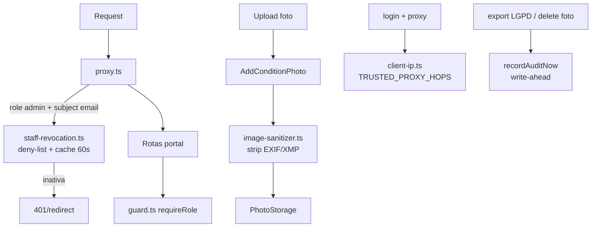

# Fase 1 — Hardening de Segurança — Design

**Spec**: `.specs/features/fase-1-hardening-seguranca/spec.md`
**Status**: Approved (decisões AD-001, AD-002, AD-004 em `.specs/STATE.md`)

## Architecture Overview

Cinco mudanças cirúrgicas, todas dentro dos padrões existentes (domínio puro, ports, envelope
`{success,data,error}`):

## Code Reuse Analysis

| Component | Location | How to Use |
|-----------|----------|------------|
| `verifySessionToken`, `Session` | `src/lib/auth/session.ts` | guard e revocation consomem |
| `passwordMatches` (timing-safe) | `src/lib/auth/session.ts` | reusar na comparação do cron secret |
| Padrão `requirePatientSession` | `src/app/api/portal/patient/consent/route.ts` | generalizar como `requireRole` em lib |
| `detectImageType` (magic bytes) | `src/domain/clinical/condition-photo.ts` | sanitizer despacha pelo tipo detectado |
| `DrizzleUserAccountRepository.findByEmail` | drizzle-foundation-repositories | lookup da revogação |
| `recordAudit` + `AuditEvent.create` | `src/lib/audit.ts` | variante `recordAuditNow` awaited |
| `fail`/`handleRequest` | `src/lib/api-response.ts` | respostas do guard |

## Components

### `src/lib/auth/client-ip.ts`
- **Purpose**: derivar IP do cliente da cadeia XFF conforme `TRUSTED_PROXY_HOPS` (default 1).
- **Interfaces**: `clientIpFromHeader(header: string | null, trustedHops?: number): string`;
  `clientIp(request: NextRequest): string` (lê env).
- **Reuses**: substitui parsing duplicado em `proxy.ts` e `api/auth/login`.

### `src/lib/auth/guard.ts`
- **Purpose**: guard único de papel para rotas do portal.
- **Interfaces**: `requireRole(request, role: UserRole): { session: Session } | { error: Response }`.
  Mensagens preservam contrato atual (401 "Não autenticado"; 403 "Rota exclusiva do portal do
  paciente" / "...do parceiro").
- **Reuses**: `getRequestSession`, `fail`.

### `src/lib/auth/staff-revocation.ts`
- **Purpose**: deny-list de contas staff inativas com cache TTL 60s (AD-001/AD-004).
- **Interfaces**: `isStaffSessionRevoked(session: Session, lookup?: (email) => Promise<{isActive: boolean} | null>, nowMs?): Promise<boolean>`
  — lookup default importa `getDb` + `DrizzleUserAccountRepository` dinamicamente (proxy não
  carrega drizzle quando não precisa). Cache module-level `Map<email,{revoked,expiresAtMs}>`.
- **Fail-open**: erro no lookup → `false` + `console.error`.

### `src/domain/clinical/image-sanitizer.ts`
- **Purpose**: remover metadados de JPEG/PNG/WebP em TS puro (AD-002).
- **Interfaces**: `stripImageMetadata(data: Uint8Array): Uint8Array` — despacha por
  `detectImageType`; tipo desconhecido ou estrutura malformada → retorna original (fail-safe;
  validação existente rejeita depois).
  - JPEG: remove APP1..APP15 e COM; preserva APP0, SOF/SOS e tudo a partir de SOS.
  - PNG: mantém apenas chunks fora de {tEXt, zTXt, iTXt, eXIf, tIME}.
  - WebP: remove chunks EXIF/XMP, corrige tamanho RIFF, zera bits EXIF(3)/XMP(2) do VP8X.
- **Wiring**: `AddConditionPhoto.execute` aplica o strip após `detectImageType` e antes de
  `ConditionPhoto.create`/`storage.write`; `sizeBytes` = tamanho pós-strip.

### `src/lib/audit.ts` (extensão)
- **Interfaces**: `recordAuditNow(auditEvents, session, input): Promise<void>` — awaited, propaga
  erro. Rotas: `patients/[id]/export` (GET) e `photos/[id]` (DELETE).

## Error Handling Strategy

| Error Scenario | Handling | User Impact |
|----------------|----------|-------------|
| DB fora na checagem de revogação | fail-open + log (AD-004) | nenhum |
| Imagem malformada no sanitizer | retorna bytes originais; validação existente responde 400 | mensagem atual |
| Falha ao gravar auditoria write-ahead | requisição falha (500 envelope) | erro explícito, sem sucesso silencioso |

## Risks & Concerns

| Concern | Location | Impact | Mitigation |
|---------|----------|--------|------------|
| Proxy vira async + import dinâmico de drizzle | `src/proxy.ts` | latência no 1º hit / bundle | import dinâmico só quando role admin + subject email; cache 60s |
| Sanitizer corromper imagem válida | image-sanitizer.ts | foto ilegível | fail-safe: qualquer inconsistência estrutural → bytes originais; testes com fixtures reais construídas byte a byte |
| E2E forja subject admin | e2e/support/session-token.ts | falso 401 | deny-list (AD-001): subject sem conta não bloqueia |

## Tech Decisions

| Decision | Choice | Rationale |
|----------|--------|-----------|
| Onde roda a revogação | proxy (não por rota) | cobertura global sem tocar ~40 rotas |
| Sanitizer no domínio | `src/domain/clinical/` | função pura de regra clínica de privacidade; testável sem infra |
| Aviso master | `console.warn` | `AUDIT_ACTIONS` não tem "login"; criar ação é escopo além do item (assumption na spec) |
