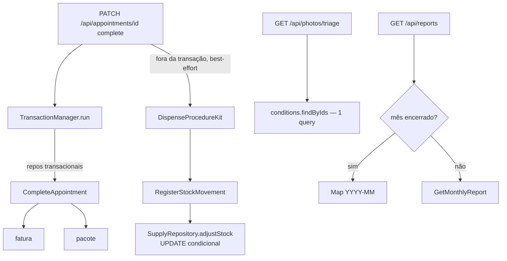

# Fase 2 — Consistência Transacional e Performance — Design

**Spec**: `.specs/features/fase-2-consistencia-performance/spec.md`
**Status**: Approved

## Architecture Overview

## Code Reuse Analysis

| Component | Location | How to Use |
|-----------|----------|------------|
| `db.transaction` (Drizzle) | já usado em `drizzle-foundation-repositories.ts:154` | base do TransactionManager |
| Construção de repos por `db` | `src/infrastructure/container.ts` | extrair fábrica `buildRepos(db)` reutilizada pelo container e pela transação |
| `Supply.registerExit/registerEntry` | domínio | continuam validando quantidade; repo ganha o caminho atômico |
| `findByPatientIds` (in/inArray) | drizzle-clinical-repositories | padrão para o novo `findByIds` |
| PGlite (transações + plpgsql ok) | tests/api | teste de rollback real |

## Components

### `src/application/ports/transaction-manager.ts`
- **Purpose**: porta de unidade de trabalho.
- **Interfaces**: `interface TransactionScope { appointments; invoices; followUps; sessionPackages }`;
  `interface TransactionManager { run<T>(fn: (repos: TransactionScope) => Promise<T>): Promise<T> }`.
  Escopo enxuto (só o que a conclusão usa) — YAGNI; amplia quando outro fluxo precisar.
- **Impls**: `DrizzleTransactionManager` (`db.transaction` + repos construídos sobre `tx`);
  `InMemoryTransactionManager` (executa `fn` com os repos existentes — no-op, CONS2-03).

### `SupplyRepository.adjustStock(id, delta): Promise<Supply | null>`
- Drizzle: `UPDATE supplies SET stock_qty = stock_qty + $delta WHERE id = $id AND stock_qty + $delta >= 0 RETURNING *`; null quando não afetou linha (insuficiente). NotFound distinguido por `findById` prévio já existente no use case.
- In-memory: mesma semântica em memória.
- `RegisterStockMovement` troca `save(updated)` por `adjustStock`; mantém exceções atuais
  (`ValidationError` de quantidade/insuficiência vem do domínio: use case chama
  `supply.registerExit(q)` ANTES para validar mensagem/regra, e `adjustStock` garante a
  condição no banco — dupla camada, mensagem idêntica).

### `ClinicalConditionRepository.findByIds(ids)`
- Drizzle `inArray` + in-memory filter; rota de triagem usa 1 chamada.

### Cache do relatório (`src/app/api/reports/route.ts`)
- `Map<string, MonthlyReport>` module-level; chave `YYYY-MM`; popula só quando `to <= início do
  mês corrente`. Sem TTL (mês fechado é imutável); tamanho bounded (≤ meses de história).

## Error Handling Strategy

| Error Scenario | Handling | User Impact |
|----------------|----------|-------------|
| Falha dentro da transação | rollback total; erro 500 envelope atual | consulta permanece não concluída; retry seguro |
| Estoque insuficiente | ValidationError atual (mensagem preservada) | aviso de kit igual ao de hoje |
| Cache com payload de classes de domínio | cache guarda o DTO serializado do use case (objeto plano) | payload idêntico |

## Risks & Concerns

| Concern | Location | Impact | Mitigation |
|---------|----------|--------|------------|
| Container monta repos uma vez por processo com `db` fixo | container.ts | transação exige repos sobre `tx` | fábrica extraída; container e TransactionManager compartilham a mesma construção |
| Calendar sync roda `after()` fora da transação | rota PATCH | ok — best-effort documentado | sem mudança |
| GetMonthlyReport retorna objetos planos? | get-monthly-report.ts | cache de referência mutável | route serializa hoje via handleRequest (JSON) — cache do objeto é seguro se ninguém muta; congela raso no cache |

## Tech Decisions

| Decision | Choice | Rationale |
|----------|--------|-----------|
| Kit fora da transação | manter best-effort | contrato do PRD O2.4 ("nunca bloqueia a conclusão") |
| Escopo do TransactionScope | 4 repos da conclusão | YAGNI; crescer sob demanda |
| Cache no route (não no use case) | route-level | use case permanece puro/testável; cache é preocupação de entrega |
