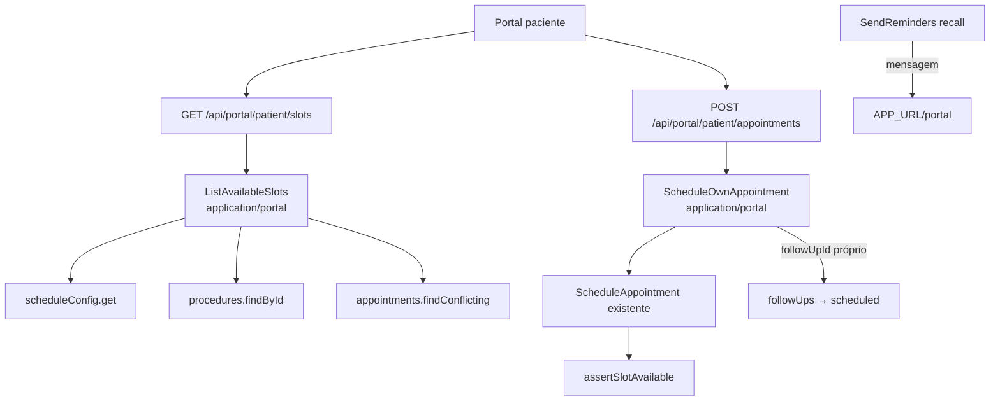

# Fase 4 — Portal: Auto-agendamento e Recall — Design

**Spec**: `.specs/features/fase-4-portal-auto-agendamento/spec.md`
**Status**: Approved

## Architecture Overview

## Code Reuse Analysis

| Component | Location | How to Use |
|-----------|----------|------------|
| `assertSlotAvailable` (grade+gap+conflito) | application/appointments | geração de slots testa cada candidato com a MESMA regra do agendamento — zero duplicação de regra |
| `ScheduleAppointment` | application/appointments | ScheduleOwnAppointment delega após resolver escopo/procedimento |
| `requireRole(request, "patient")` | lib/auth/guard (fase 1) | guard das novas rotas |
| `SetFollowUpStatus`/repo followUps | application/followups | marcar `scheduled` |
| `recordAudit` | lib/audit | PORT4-08 |
| `toPortalAppointmentDto` | lib/dto | resposta do POST |
| Grade `ScheduleConfig` + `DEFAULT_SCHEDULE_CONFIG` | domain/scheduling | janela e passo dos slots |

## Components

### `src/application/portal/list-available-slots.ts`
- **Input**: `{ email, procedureId, date (dia local YYYY-MM-DD) }`.
- Lógica: paciente ativo por email (escopo); procedimento ativo do catálogo → duração; config da
  grade; candidatos = horas de `startHour` até `endHour − duração`, passo = duração (minutos);
  filtra: candidato no passado (relativo a `now`) fora; cada candidato validado com
  `assertSlotAvailable` (capturando conflito → exclui). Retorna `{ startsAt, endsAt }[]`.
- Dia fora da grade → `[]` (assertWithinBusinessHours lançaria; tratar via checagem de weekday
  antes ou capturando o erro — capturar e devolver `[]`).

### `src/application/portal/schedule-own-appointment.ts`
- **Input**: `{ email, procedureId, startsAt, followUpId? }`.
- Paciente por email (ativo); procedimento ativo → preço/duração (endsAt derivado);
  `followUpId` → followUps.findById, pertence ao paciente e pending, senão NotFound;
  delega a `ScheduleAppointment` (sem professionalId — regra global, default seguro);
  sucesso → follow-up `scheduled` (se veio). Retorna appointment.
- Nota transação: agendamento + follow-up não compartilham invariante de billing; falha após
  criar consulta deixa follow-up pendente (inofensivo — staff vê os dois). Documentado.

### Rotas
- `GET /api/portal/patient/slots?procedureId&date` → guard patient → ListAvailableSlots.
- `POST /api/portal/patient/appointments` → guard patient → ScheduleOwnAppointment + audit
  (`action: "create", resourceType: "appointment"`, detail "agendado pelo portal") + calendar
  sync best-effort (mesmo helper das rotas staff, `scheduleCalendarSync`).
- Procedimentos ofertáveis: `GET /api/portal/patient/procedures` (ativos, nome/duração) — o
  portal não deve consumir a rota staff (proxy bloqueia patient em /api/procedures).

### Recall (PORT4-09)
`SendReminders.recallReminders`: mensagem passa a "... agende seu retorno no portal: {APP_URL}/portal".
APP_URL via env (fallback: manter frase sem link quando ausente).

### UI Portal (PORT4-10..11)
Seção de follow-ups pendentes ganha botão "Agendar retorno" → painel: select de procedimento,
data (14 dias), horários (fetch slots) → confirmar → refresh dos dados do portal.

## Error Handling

| Scenario | Handling |
|----------|----------|
| Slot tomado entre listagem e POST | erro de conflito atual (409) — UI pede outro horário |
| Procedimento inativo | 404 NotFound padrão |
| followUpId de outro paciente | 404 (sem vazar existência) |

## Tech Decisions

| Decision | Choice | Rationale |
|----------|--------|-----------|
| Sem escolha de profissional | consulta sem profissional (conflita com tudo) | default seguro; decisão de negócio adiada (spec) |
| Slots passo = duração | simples e previsível | evita fragmentação da agenda pela ponta do paciente |
| Rota própria de procedimentos no portal | /api/portal/patient/procedures | RBAC do proxy é por prefixo; não abrir rota staff |

## Tasks (execução inline, 3 fases)

### T1: `ListAvailableSlots` + rotas GET slots/procedures
**Req**: PORT4-01..03 | **Tests**: unit (use case) + integration (rotas) | **Gate**: full
**Commit**: `feat(portal): horários disponíveis para auto-agendamento`

### T2: `ScheduleOwnAppointment` + rota POST + audit + recall com link
**Req**: PORT4-04..09 | **Tests**: unit + integration | **Gate**: full
**Commit**: `feat(portal): paciente agenda retorno pelo portal e recall aponta para o portal`

### T3: UI do portal (agendar retorno)
**Req**: PORT4-10..11 | **Tests**: page (jsdom) | **Gate**: build (último)
**Commit**: `feat(portal): fluxo de agendamento de retorno na interface do paciente`
