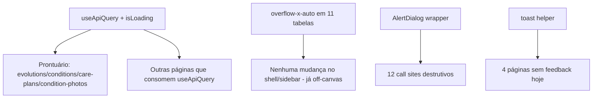

# Fase A — Padrões Estruturais Design

**Spec**: `.specs/features/fase-a-padroes-estruturais/spec.md`
**Status**: Draft

---

## Architecture Overview

4 mudanças estruturais independentes, sem dependência entre si — podem ser feitas em qualquer ordem ou em paralelo por fase:

Nenhuma dessas 4 mudanças toca schema de banco, rota de API ou contrato externo — são puramente client-side (hook, CSS, componente de confirmação, chamada de toast).

---

## Code Reuse Analysis

### Existing Components to Leverage

| Component | Location | How to Use |
| --- | --- | --- |
| `useApiQuery` | `src/lib/use-api-query.ts` | Estender com `isLoading`, sem quebrar assinatura atual |
| `EmptyState` | `@still-void/ui` (já em uso) | Manter só para "0 registros", nunca para erro |
| `ErrorAlert` (local) | usado em `conditions-section.tsx`, `care-plans-section.tsx` | Padrão a generalizar para os demais consumidores de `useApiQuery` que hoje não distinguem erro |
| `AlertDialog`, `AlertDialogTrigger`, `AlertDialogContent`, `AlertDialogHeader/Footer/Title/Description` | `@still-void/ui/react/client` | Já no bundle (3.3.1), nunca importado no projeto — usar diretamente, sem wrapper próprio |
| `useToast` / `ToastProvider` | `@still-void/ui/react/client`; provider já montado em `src/app/providers.tsx` | Reusar padrão já usado em 14 páginas (`variant: "success" | "danger"`) |
| `apiFetch` | `src/lib/client.ts` | Sem mudança — origem dos erros que `useApiQuery`/mutações capturam |

### Integration Points

| System | Integration Method |
| --- | --- |
| `useApiQuery` consumers | Cada página passa a checar `isLoading` → `error` → `data` vazio, nessa ordem |
| Tabelas Tailwind | Envolver `<table>`/`<Table>` existente num `
`, sem mudar a tabela em si |
| Ações destrutivas | Extrair componente `ConfirmAction` (novo, local) que encapsula `AlertDialog` + trigger, parametrizado por título/descrição/label do botão/variant |
| Toast em mutação | Cada handler de mutação nas 4 páginas-alvo chama `toast({ description, variant })` no `.then`/`.catch`, igual ao padrão das 14 páginas existentes |

---

## Components

### 1. `useApiQuery` com `isLoading`

- **Purpose**: Distinguir "carregando" de "erro" de "vazio" pra todo consumidor.
- **Location**: `src/lib/use-api-query.ts`
- **Interfaces**:
  - `useApiQuery<T>(url: string | null): { data: T | null; error: string | null; isLoading: boolean; refresh: () => void }`
- **Dependências**: nenhuma nova; usa `apiFetch` já existente.
- **Reuses**: implementação atual, só adiciona um `useState<boolean>` e ajusta o `useEffect` (seta `true` antes do fetch, `false` em `.then`/`.catch`).
- **Nota de compatibilidade**: `isLoading` é campo novo aditivo — nenhum consumidor existente quebra por não usá-lo. Consumidores migrados (Prontuário + os que hoje confundem erro/vazio) passam a checá-lo.

### 2. `ConfirmAction` (novo)

- **Purpose**: Padronizar `AlertDialog` de confirmação com copy específica por ação, evitando 12 implementações divergentes.
- **Location**: `src/components/confirm-action.tsx` (novo)
- **Interfaces**:
  - `<ConfirmAction trigger={ReactNode} title={string} description={string} confirmLabel={string} onConfirm={() => void | Promise<void>} variant?="default" | "danger">`
- **Dependências**: `AlertDialog*` de `@still-void/ui/react/client`.
- **Reuses**: nada existente (gap real — é o componente que a auditoria já apontava como "no catálogo, não usado").

### 3. Wrapper `overflow-x-auto` nas 11 tabelas

- **Purpose**: Conter scroll horizontal na tabela, não na página.
- **Location**: as 11 páginas já levantadas (ver Requirement Traceability da spec) — mudança inline, sem novo componente.
- **Dependências**: nenhuma.
- **Reuses**: padrão CSS já usado em outras telas do projeto que já têm `overflow-x-auto` (confirmar 1 exemplo existente antes de aplicar, pra manter classe idêntica).

### 4. Toast de sucesso/erro nas 4 páginas-alvo

- **Purpose**: Fechar o gap de feedback em `pacientes`, `configuracoes`, `portal/patient-view`, `portal/consent-card`.
- **Location**: as 4 páginas, inline nos handlers de mutação já existentes.
- **Dependências**: `useToast` de `@still-void/ui/react/client` (hook, não precisa de novo provider).
- **Reuses**: exatamente o padrão das 14 páginas que já chamam `toast({ description, variant })`.

---

## Data Models

Nenhum modelo de dado novo — mudança é 100% de apresentação/estado de UI client-side.

---

## Ações destrutivas levantadas (12 call sites confirmados no código)

| # | Página | Ação/handler | Consequência a nomear na copy |
| --- | --- | --- | --- |
| 1 | `(staff)/page.tsx` (dashboard) | `resolveFollowUp(id, "cancelled")` — "Cancelar" retorno | Cancela o retorno agendado; paciente não é mais lembrado |
| 2 | `(staff)/page.tsx` | `triage(photo, "reviewed")` — "Ok, manter plano" | Marca a foto como revisada sem intervenção; não há ação de reabrir |
| 3 | `(staff)/page.tsx` | `triage(photo, "escalated")` — "Antecipar retorno" | Antecipa o retorno do paciente com base na foto |
| 4 | `faturamento/page.tsx` | `onCancel(invoice)` — "Cancelar" fatura | Cancela a fatura permanentemente |
| 5 | `parceiros/page.tsx` | toggle `active → false` — "Desativar" | Parceiro para de aparecer nos fluxos ativos |
| 6 | `pacientes/page.tsx` | toggle `active → false` — "Desativar" | Paciente para de aparecer nos fluxos ativos |
| 7 | `procedimentos/page.tsx` | toggle `active → false` — "Desativar" | Procedimento para de estar disponível pra agendar |
| 8 | `profissionais/page.tsx` | toggle `active → false` — "Desativar" | Profissional para de estar disponível pra agendar |
| 9 | `configuracoes/page.tsx` | toggle `active → false` — "Desativar" conta | Conta perde acesso ao sistema imediatamente |
| 10 | `pacientes/[id]/care-plans-section.tsx` | `resolveCarePlan` — "Resolver plano" | Trava o plano de cuidados permanentemente; **não existe ação de reabrir** |
| 11 | `pacientes/[id]/conditions-section.tsx` | `resolveCondition` — "Resolver condição" | Trava a condição clínica permanentemente; **não existe ação de reabrir** |
| 12 | `pacientes/[id]/condition-photos.tsx` | delete foto — "Excluir" | Remove a evidência clínica (foto) permanentemente |

**Nota**: "Reativar" (lado oposto do toggle nos itens 5–9) NÃO é destrutivo/irreversível — fica fora do `ConfirmAction`, só o caminho `active → false` passa por confirmação. A contagem "~15" da auditoria conta ocorrências por linha de tabela; os 12 call sites acima cobrem os mesmos handlers.

---

## Error Handling Strategy

| Error Scenario | Handling | User Impact |
| --- | --- | --- |
| `useApiQuery` recebe 4xx/5xx | `error` populado, `isLoading: false`, página renderiza bloco de erro (não `EmptyState`) com botão "Tentar novamente" chamando `refresh()` | Usuário vê claramente que é falha técnica, não ausência de dado |
| `ConfirmAction.onConfirm` lança (API falha após confirmar) | `onConfirm` já é o handler de mutação existente, que por sua vez já dispara toast de erro (história 4) | Toast `variant="danger"` com a mensagem; dialog fecha, dado não muda |
| Mutação nas 4 páginas-alvo falha | `catch` chama `toast({ description: mensagem, variant: "danger" })` | Usuário vê toast vermelho com a causa |

---

## Risks & Concerns

| Concern | Location | Impact | Mitigation |
| --- | --- | --- | --- |
| `useApiQuery` sem cache compartilhado (L-008) | `src/lib/use-api-query.ts:13` | Adicionar `isLoading` não resolve o problema de dois componentes divergirem após mutação — mas não piora, pois é aditivo | Fora de escopo (registrado em Out of Scope); L-008 permanece válido para trabalho futuro |
| 12 call sites de `ConfirmAction` tocam páginas com testes existentes | várias | Migrar `onClick` direto para `ConfirmAction` pode quebrar testes que hoje clicam o botão e esperam a chamada de API imediata | Cada task de migração deve atualizar o teste da página pra simular clique no trigger + clique em confirmar no dialog, antes de assertar a chamada de API |
| Toast pattern varia ligeiramente entre as 14 páginas existentes (algumas passam `title`, outras só `description`) | `src/app/(staff)/**` | Padronizar as 4 novas pode divergir do estilo já usado se não checarmos um exemplo antes | Task de "toast" lê 1 exemplo existente (ex. `faturamento/page.tsx`) e replica a mesma forma de chamada |

> Nenhum risco bloqueante identificado.

---

## Tech Decisions

| Decision | Choice | Rationale |
| --- | --- | --- |
| `isLoading` como campo aditivo vs. union type de estado (`"idle" | "loading" | "error" | "success"`) | Campo aditivo (`isLoading: boolean` + `error`/`data` existentes) | Migração incremental sem quebrar os ~14 consumidores atuais que não usam `isLoading`; union type exigiria migrar todos de uma vez |
| Componente único `ConfirmAction` vs. `AlertDialog` inline em cada página | Componente único `src/components/confirm-action.tsx` | Evita 12 implementações divergentes da copy/estrutura; é exatamente o "padrão único reaproveitável" pedido na issue #59 |
| `overflow-x-auto` só no wrapper da tabela vs. mudar o shell | Só wrapper da tabela | Design.md (Assumptions da spec) já confirmou que o shell (`SidebarProvider`) já é off-canvas — o gap real é local à tabela |

---

## Tips aplicadas
- Reuso confirmado antes de escrever qualquer componente novo (`ConfirmAction` é o único novo — todo o resto é extensão de código existente).
