# Fase C — LGPD / Segurança de Dado Design

**Spec**: `.specs/features/fase-c-lgpd-seguranca-dado/spec.md`
**Status**: Draft

---

## Architecture Overview

4 subsistemas independentes, cada um plugando em infraestrutura já existente — nenhum componente novo de plataforma, só extensão de pontos que já existem (`recordAudit`, `encryptSecret`/`decryptSecret`, `ConsentRecord`, DTOs de `src/lib/dto.ts`).

```mermaid
graph TD
    subgraph "#69 Portal allowlist"
        A1[GET /api/portal/patient] --> A2[toPortalConditionDto / toPortalAssessmentDto]
        A3[GET /api/portal/partner] --> A2
        A2 -->|nunca inclui notes| A4[JSON response]
    end

    subgraph "#70 Consentimento"
        B1[POST /api/portal/patient/consent] --> B2[ConsentRecord.create]
        B3[POST /api/portal/patient/consent/revoke NOVO] --> B4[ConsentRecord.revoke NOVO]
        B2 --> B5[(consent_records)]
        B4 --> B5
        B6[GET /api/portal/patient/consent NOVO status] --> B5
    end

    subgraph "#71 Auditoria"
        C1[login/logout/set-password] --> C2[recordAuditNow + ator explícito NOVO param]
        C3[criar paciente / clinic-info / schedule] --> C4[recordAudit existente]
        C2 --> C5[(audit_events)]
        C4 --> C5
    end

    subgraph "#72 Cifra em repouso"
        D1[AddEvolutionNote / salvar condição / avaliação] --> D2[encryptSecret AES-256-GCM]
        D2 --> D3[(evolution_notes / clinical_conditions / condition_assessments)]
        D3 --> D4[decryptSecret na leitura]
        D5[Script de migração de dado único] --> D3
    end
```



---

## Code Reuse Analysis

### Existing Components to Leverage

| Component | Location | How to Use |
| --- | --- | --- |
| `encryptSecret`/`decryptSecret` (AES-256-GCM) | `src/lib/auth/crypto.ts` | Reusado sem alteração para os 7 campos de #72 |
| `recordAudit`/`recordAuditNow` | `src/lib/audit.ts` | Estendido com parâmetro opcional de ator explícito; chamado nos 6 pontos novos de #71 |
| `AuditEvent` (domínio) | `src/domain/audit/audit-event.ts` | Sem alteração — `actorRole`/`actorId` já são campos livres |
| `ConsentRecord` (append-only) | `src/domain/consent/consent-record.ts` | Mesmo padrão de imutabilidade estendido com `kind: "accept" | "revoke"` |
| `toXxxDto` pattern | `src/lib/dto.ts` | Mesmo padrão de função pura de mapeamento aplicado às 2 novas funções allowlist |
| `withTenant` | `src/infrastructure/persistence/drizzle/tenant-scope.ts` | Sem alteração — repositórios cifrados continuam usando o helper normalmente |
| `getAuthConfig()` | `src/lib/auth/session.ts` | Fonte do secret de cifra (mesma chave do resto da auth, AD já ativa) |

### Integration Points

| System | Integration Method |
| --- | --- |
| `getRepositories()` (`src/infrastructure/container.ts`) | Passa `auth.secret` para os 3 repositórios Drizzle cifrados; lança se `AUTH_SECRET` ausente e um desses repositórios for solicitado |
| Rotas `/api/portal/patient`, `/api/portal/partner` | Trocam `toConditionDto`/`toAssessmentDto` por `toPortalConditionDto`/`toPortalAssessmentDto` |
| Rotas `auth/login`, `auth/logout`, `auth/set-password` | Ganham chamada a `recordAuditNow` com ator explícito (não há `Session` ainda) |
| Rotas `patients` (POST), `settings/clinic-info` (PUT), `settings/schedule` (PUT) | Ganham chamada a `recordAudit` já com `Session` disponível |
| `drizzle/` migrações | 1 migration de schema (`consent_records.kind`/`version`) + 1 script de dado (cifrar linhas existentes) |

---

## Components

### `toPortalConditionDto` / `toPortalAssessmentDto` (#69)

- **Purpose**: DTO allowlist do portal — tipo TS sem `notes`, para que o compilador acuse se alguém tentar reexpor o campo.
- **Location**: `src/lib/dto.ts` (junto das outras funções `toXxxDto`)
- **Interfaces**:
  - `toPortalConditionDto(condition: ClinicalCondition): PortalConditionDto` — omite `notes`
  - `toPortalAssessmentDto(assessment: ConditionAssessment): PortalAssessmentDto` — omite `notes`
- **Dependencies**: nenhuma nova; usa os getters já existentes do domínio.
- **Reuses**: mesmo padrão de `toConditionDto`/`toAssessmentDto`, que continuam existindo intactas para as rotas de staff.

### `GetPatientPortalData` / `GetPartnerPortalData` (sem mudança de assinatura)

Nenhuma mudança nos use cases — eles devolvem entidades de domínio; a filtragem acontece só na borda (rota → DTO), que é onde a issue #69 pede allowlist explícita. Manter a filtragem na borda evita duplicar regra de negócio no domínio.

### `ConsentRecord` — revogação (#70)

- **Purpose**: Estender o registro append-only para cobrir revogação e versão do texto.
- **Location**: `src/domain/consent/consent-record.ts`
- **Interfaces**:
  - `ConsentRecord.create(input: { patientId, consentText, textVersion, ipAddress? }): ConsentRecord` — grava `textVersion` além do hash (campo novo, `CONSENT_TEXT_VERSION` importado do chamador)
  - `ConsentRecord.revoke(input: { patientId, ipAddress? }): ConsentRecord` — novo método estático, cria registro `kind: "revoke"`
  - `ConsentRecordRepository.findLatestByPatientId(patientId: string): Promise<ConsentRecord | null>` — novo método (mais recente por `acceptedAt`), usado pra status
- **Dependencies**: nenhuma nova.
- **Reuses**: `hashConsentText`, padrão de imutabilidade já existente.

Campo novo no estado: `kind: "accept" | "revoke"` (default `"accept"` em `restore` para linhas legadas — todo registro existente hoje é aceite). `textVersion: string | null` (null em linhas legadas pré-#70, que continuam válidas pelo hash).

### `AuditInput` — ator explícito pré-sessão (#71)

- **Purpose**: Permitir registrar auditoria em rotas que autenticam mas ainda não têm `Session` (login, set-password).
- **Location**: `src/lib/audit.ts`
- **Interfaces**:
  - `recordAuditNow(auditEvents, session: Session | null, input: AuditInput & { actorOverride?: { role: string; id: string; clinicId: string | null } }): Promise<void>`
  - `recordAudit` ganha o mesmo parâmetro opcional, mesma assinatura estendida
  - Quando `actorOverride` está presente, `persistAuditEvent` usa `actorOverride.role`/`.id`/`.clinicId` em vez de `session?.role`/`session?.subject`/`session?.clinicId`
- **Dependencies**: nenhuma nova.
- **Reuses**: `AuditEvent.create`, `LEGACY_CLINIC_ID` fallback já existente.

### 3 repositórios Drizzle cifrados (#72)

- **Purpose**: Cifrar/decifrar os 7 campos sensíveis na fronteira do repositório — domínio e aplicação continuam falando texto plano.
- **Location**: `src/infrastructure/persistence/drizzle/drizzle-clinical-repositories.ts`
- **Interfaces** (assinatura de construtor muda nos 3):
  - `new DrizzleEvolutionNoteRepository(db, clinicId, secret: string)`
  - `new DrizzleClinicalConditionRepository(db, clinicId, secret: string)`
  - `new DrizzleConditionAssessmentRepository(db, clinicId, secret: string)`
  - Métodos públicos (`save`, `findByPatientId`, etc.) mantêm a mesma assinatura — cifra é interna.
- **Dependencies**: `encryptSecret`/`decryptSecret` de `src/lib/auth/crypto.ts`.
- **Reuses**: mesmas queries Drizzle já existentes; só o valor gravado/lido nas colunas de texto muda.

**InMemory repositories** (`in-memory-clinical-repositories.ts`) **não mudam** — cifra é preocupação de armazenamento em repouso (Postgres real), e os testes de use case continuam operando sobre objetos em memória sem cifra. Isso preserva os testes existentes sem alteração e mantém o teste de cifra isolado no nível de repositório Drizzle (integração).

### Script de migração de dado (#72)

- **Purpose**: Cifrar linhas já existentes em `evolution_notes`, `clinical_conditions`, `condition_assessments`, uma única vez, idempotente.
- **Location**: `scripts/encrypt-clinical-fields.ts` (novo, executado manualmente via `tsx` — não é migration Drizzle porque não altera schema, só dado; roda depois da migration que documenta a mudança)
- **Interfaces**: `main()` — lê `AUTH_SECRET` do ambiente, itera as 3 tabelas em lote, tenta `decryptSecret` antes de cifrar (se já decifra com sucesso, já está cifrado — pula) — é o que garante idempotência sem coluna de controle nova.
- **Dependencies**: `getDb()`, `encryptSecret`/`decryptSecret`.

---

## Data Models

### `consent_records` (schema Drizzle — campos novos)

```typescript
{
  // ...campos existentes (id, clinicId, patientId, textHash, ipAddress, acceptedAt)
  kind: text("kind").notNull().default("accept"), // "accept" | "revoke"
  textVersion: text("text_version"), // null em linhas legadas
}
```

**Relationships**: mesma tabela, sem nova FK. `findLatestByPatientId` ordena por `acceptedAt desc` e olha `kind` do registro mais recente para decidir status.

### `evolution_notes` / `clinical_conditions` / `condition_assessments`

Sem mudança de schema (colunas `text` já comportam o payload cifrado, que é uma string maior no formato `iv.tag.ciphertext` de `encryptSecret`). Mudança é só de **conteúdo**, não de coluna.

---

## Error Handling Strategy

| Error Scenario | Handling | User Impact |
| --- | --- | --- |
| `AUTH_SECRET` ausente e rota tenta ler/gravar campo cifrado | `getRepositories` lança ao construir os 3 repositórios cifrados (mesmo padrão de `getAuthConfig()` retornando null → 503 no resto da auth) | 500 com log server-side; rota nunca grava em claro como fallback |
| Payload cifrado corrompido na leitura (`decryptSecret` lança) | Propaga o erro (não silencia) — mesmo comportamento hoje do refresh token do Google | 500; log server-side aponta a linha afetada |
| Revogação de consentimento duplicada (duplo clique) | `ConsentRecord.revoke` sempre cria um novo registro `kind: "revoke"` — múltiplos registros de revogação seguidos são válidos e idempotentes no efeito (status final continua "revogado") | Sem erro visível ao paciente |
| Login falha (credencial inválida) | Evento de auditoria registrado com `detail: "invalid_credentials"` antes do fail-closed rate-limit response | Resposta HTTP inalterada (401), só ganha trilha |
| Falha ao gravar evento de auditoria em rota crítica (login/logout/set-password) | `recordAuditNow` propaga erro → `handleRequest`/catch da rota falha o request (AC-08) | Usuário recebe erro genérico; ação NÃO é considerada bem-sucedida sem trilha |
| Falha ao gravar evento de auditoria em rota não crítica (criar paciente, clinic-info, schedule) | `recordAudit` (via `after()`) já é best-effort — loga e segue | Sem impacto visível; comportamento já existente preservado |

---

## Risks & Concerns

| Concern | Location (file:line) | Impact | Mitigation |
| --- | --- | --- | --- |
| Modo aberto de dev (`VITTA_ALLOW_OPEN_MODE=true`, sem `AUTH_SECRET`) quebra ao tocar rota clínica cifrada | `src/infrastructure/container.ts` (`getRepositories`) | Dev local sem `AUTH_SECRET` configurado não consegue mais criar evolução/condição/avaliação | Aceito e documentado: `AUTH_SECRET` já é necessário pra qualquer sessão real; modo aberto é só pra rotas sem dado clínico sensível tocado nos fluxos que hoje o usam. `.env.example` já pede `AUTH_SECRET` |
| `Anamnesis` (comorbidades, alergias, medicações) fica em claro, mesmo sendo dado de saúde tão sensível quanto os 3 campos cifrados | `src/domain/clinical/anamnesis.ts` | Gap parcial de LGPD art. 11 permanece pós-#72 | Fora do escopo desta issue por decisão do usuário (ver spec Out of Scope) — registrar como candidato de fase futura no relatório final |
| Script de migração de dado roda fora do pipeline de `drizzle-kit migrate` (é `tsx` manual) | novo `scripts/encrypt-clinical-fields.ts` | Alguém pode esquecer de rodar em produção depois do deploy | Documentar no PR/README de deploy; script é idempotente então pode rodar mais de uma vez sem risco |
| `ConditionAssessment.notes` e `ClinicalCondition.notes` cifrados tornam impossível buscar/filtrar por texto desses campos no banco (`ILIKE`) | `src/infrastructure/persistence/drizzle/drizzle-clinical-repositories.ts` | Se existir hoje alguma busca por texto nesses campos, ela quebra | Verificado: nenhum repositório atual faz `ILIKE`/busca textual nesses 2 campos (grep confirma) — sem regressão |

---

## Tech Decisions (only non-obvious ones)

| Decision | Choice | Rationale |
| --- | --- | --- |
| Onde cifrar/decifrar | Fronteira do repositório Drizzle (infraestrutura), não no domínio | Domínio (`EvolutionNote`, `ClinicalCondition`, `ConditionAssessment`) continua testável em memória sem depender de secret; cifra é puramente "como persistimos", não "o que o dado significa" |
| InMemory repos não cifram | Mantidos como estão | Cifra é propriedade do backend Postgres real; testes de use case (que usam InMemory) não precisam simular isso — o teste de cifra fica no nível de integração Drizzle |
| Migração de dado como script `tsx`, não `drizzle-kit` migration | Script separado, idempotente por tentativa de decifra | `drizzle-kit` migration roda no boot (padrão do projeto) — rodar cifra pesada de todas as linhas no boot é risco de timeout; script manual dá controle de quando rodar em produção |
| Allowlist do portal como função separada, não `omit()`/`delete` no objeto existente | Duas funções novas (`toPortalConditionDto`/`toPortalAssessmentDto`) com tipo próprio | AC-03 exige que campo novo no domínio NÃO apareça por padrão — só typed allowlist (literal object com cada campo nomeado) garante isso em compile-time; `delete obj.notes` ou `omit<T, "notes">` ainda propagaria campo novo automaticamente |
| Ator de auditoria pré-sessão via parâmetro `actorOverride`, não criação de "sessão fake" | Estende `AuditInput` | Criar uma `Session` sintética abriria a possibilidade de ela vazar pra outro código que espera uma sessão real (cookie, TTL); um override explícito só existe dentro da própria chamada de auditoria |

---

## Confirmação de decisão de projeto

Nenhuma das decisões acima é conflitante com `AD-001`..`AD-020` de `.specs/STATE.md`. `AD-017` (withTenant) e `AD-018` (padrão de gateway/secret) são reforçados, não superados — este design não precisa de novo `AD-NNN`, porque não introduz convenção nova além de "reusar `encryptSecret` pra novos campos", que já é o padrão implícito desde AD-018.
