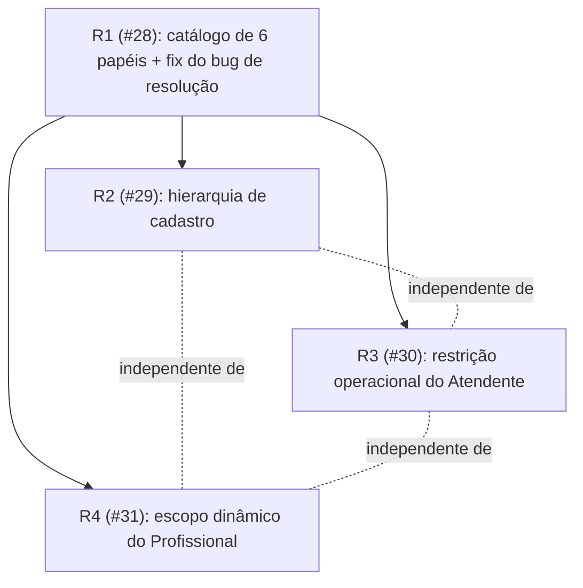

# RBAC: Catálogo de 6 Papéis — Design

**Spec**: `.specs/features/rbac-catalogo-papeis/spec.md`
**Status**: Approved
**ADR**: [003-modelo-de-papeis-multi-empresa.md](../../../docs/adr/003-modelo-de-papeis-multi-empresa.md)

---

## Architecture Overview

Quatro camadas, uma por sub-issue, estritamente sequenciais (cada uma constrói sobre a anterior):



R2/R3/R4 só dependem de R1 entre si (confirmado pelos `Blocked by` das próprias issues) — podem ser implementadas em qualquer ordem relativa, mas a ordem cronológica pedida (R1→R2→R3→R4) é mantida por ser a ordem das issues no GitHub.

Nenhuma nova camada de execução é introduzida: a extensão entra nos três pontos que já formam a política de autorização hoje —

1. **`access-policy.ts`** (política pura, sem I/O) ganha uma classificação de rota por família (operacional / clínico / administrativo) e uma matriz papel×família.
2. **`require-session.ts`** (guarda em cada handler) ganha `requireRole(request, roles)` genérico e, para R4, uma checagem adicional de vínculo Profissional↔paciente feita no próprio handler (não dá para ser só path-based, depende do `:id` da rota).
3. **`proxy.ts`** (borda) continua chamando só `isAllowedForRole` — grosso, sem I/O — como já faz hoje.

---

## Code Reuse Analysis

### Existing Components to Leverage

| Component | Location | How to Use |
| --- | --- | --- |
| `Session.clinicId: string \| null` | `src/lib/auth/session.ts:25-33` | Já existe; `null` passa a significar exclusivamente Super Admin (hoje seria só "papel de sistema", que era só admin). |
| `requirePortalSession(request, roles)` | `src/lib/auth/require-session.ts:86-104` | Já aceita array de papéis — vira a base do novo `requireRole` genérico para rotas de equipe, generalizando `requireStaffSession`. |
| `withTenant(table, clinicId, extra?)` (AD-017) | `src/infrastructure/persistence/drizzle/tenant-scope.ts` | Reusado tal qual para toda query de R2 (hierarquia por empresa) — nenhuma mudança necessária no helper. |
| `tests/support/session.ts` (`sessionToken`, `cookieHeaderFor`) | `tests/support/session.ts` | Já parametrizado por `UserRole`; passa a aceitar os 6 valores sem mudança de assinatura. |
| `tests/api/route-guard-conformance.test.ts` | mesmo arquivo | Estendido (não reescrito) para os 6 papéis e para as novas famílias de rota. |
| `ResolveUserRole` (Google OAuth) | `src/application/auth/resolve-user-role.ts` | Mantido nesta entrega (removido só na #21); ganha `superAdminEmails` além de `adminEmails` — na prática o mesmo allowlist, renomeado semanticamente. |
| Padrão de migração Drizzle já usado em M1-M6 (issue #19) | `drizzle/` | Mesmo padrão para a migração de `role` + link table de R4. |

### Integration Points

| System | Integration Method |
| --- | --- |
| `user_accounts` (Postgres) | Nova coluna `role` (`text`, `NOT NULL`, novo enum de 6 valores); `clinic_id` passa de `NOT NULL` para nullable (Super Admin). |
| `POST /api/accounts` | Passa a exigir `role` no payload; valida hierarquia antes de criar. |
| Rotas de paciente/agenda/prontuário já existentes | Guardas trocam de `requireStaffSession` (binário) para `requireRole(request, [...])` por família de rota; rotas de paciente individual (`/api/patients/[id]/*`) ganham checagem extra de vínculo quando `session.role === "profissional"`. |

---

## Approach Exploration (escopo dinâmico do Profissional — R4)

Três abordagens possíveis para "Profissional vê só pacientes com quem tem vínculo":

1. **Query ao vivo em `appointments` + `evolution_notes` (UNION), sem tabela nova.** Nenhuma migração de dados; toda checagem de acesso e toda listagem de pacientes do Profissional faz um `EXISTS` contra as duas tabelas. Problema: não cobre a AC "Profissional que cadastra um Paciente ganha acesso imediato, antes de qualquer agendamento" — nesse instante não existe nem appointment nem evolution note.
2. **Tabela de vínculo dedicada (`professional_patient_links`), populada automaticamente por trigger/hook toda vez que um appointment ou evolution note é criado, mais um vínculo explícito no cadastro do paciente.** Uma única fonte de verdade, fácil de auditar e de testar (`findLinkedPatientIds(professionalId)` vira um SELECT simples); nunca precisa reconciliar com histórico deletado, porque o vínculo nunca é removido (satisfaz RBAC-21 "nunca revogado" diretamente, por construção).
3. **Campo `createdByProfessionalId` em `patients` + UNION com appointments/evolution_notes.** Resolve o caso do cadastro sem tabela nova, mas mistura duas fontes de verdade (uma coluna em `patients`, um UNION em outras duas tabelas) e a query de "todos os pacientes vinculados a este profissional" vira 3-way UNION em todo lugar que precisa checar.

**Recomendação: abordagem 2** (tabela de vínculo dedicada). Trade-off aceito: mais uma tabela e mais um ponto de escrita (toda criação de appointment/evolution note com `professionalId` precisa também gravar/`ON CONFLICT DO NOTHING` no link) — mas isso é um único ponto de integração (`ProfessionalPatientLinkRepository.ensureLink`), reusável dos 3 call sites (cadastro de paciente, criação de appointment, criação de evolution note), e resolve as 5 ACs de R4 sem UNION disperso pela base. Aprovada.

---

## Components

### Domain: `UserRole` (expandido)

- **Purpose**: Catálogo fechado de 6 papéis.
- **Location**: `src/domain/auth/user-role.ts`
- **Interfaces**:
  ```typescript
  export const USER_ROLES = [
    "super_admin",
    "company_admin",
    "atendente",
    "profissional",
    "patient",
    "partner",
  ] as const;
  export type UserRole = (typeof USER_ROLES)[number];
  ```
- **Dependencies**: nenhuma (tipo puro).
- **Reuses**: substitui o array de 3 valores no mesmo arquivo — todo consumidor (`Session`, testes, schema) já importa daqui.

### Domain: `RoleHierarchy` (novo)

- **Purpose**: Regra pura "quem pode cadastrar quem" — usada por R2, testável sem banco.
- **Location**: `src/domain/auth/role-hierarchy.ts`
- **Interfaces**:
  - `canProvision(actorRole: UserRole, targetRole: UserRole): boolean`
  - `PROVISIONING_MATRIX: Record<UserRole, readonly UserRole[]>` (papéis que cada papel pode cadastrar)
- **Dependencies**: `UserRole`.
- **Reuses**: nada — regra nova, mas segue o padrão de política pura já usado em `access-policy.ts`.

### Domain: `RouteFamily` (novo)

- **Purpose**: Classifica um `pathname` em `"operational" | "clinical" | "administrative" | "shared"`, e decide se um papel acessa aquela família — usado por R1 (regra grosseira) e R3 (Atendente).
- **Location**: `src/lib/auth/route-family.ts`
- **Interfaces**:
  - `classifyRoute(pathname: string): RouteFamily`
  - `isFamilyAllowedForRole(family: RouteFamily, role: UserRole): boolean`
- **Dependencies**: `UserRole`.
- **Reuses**: convive com `isAllowedForRole` em `access-policy.ts` (chamada por ele), preservando o único ponto de política consumido por proxy + handler.

**Classificação de família por prefixo** (fecha RBAC-05/RBAC-15/RBAC-16):

| Família | Prefixos | Quem acessa |
| --- | --- | --- |
| `clinical` | `/api/patients/[id]/evolutions`, `/api/patients/[id]/conditions`, `/api/patients/[id]/anamnesis`, `/api/patients/[id]/care-plans`, `/api/conditions`, `/api/photos`, `/api/care-plan-*` | `super_admin`, `company_admin`, `profissional` (com vínculo — checado no handler) |
| `operational` | `/api/appointments`, `/api/patients` (exceto sub-rotas clínicas acima), `/api/partners`, `/api/follow-ups`, `/api/reminders`, `/api/settings/schedule` | `super_admin`, `company_admin`, `atendente`, `profissional` |
| `administrative` | `/api/accounts`, `/api/professionals`, `/api/supplies*`, `/api/procedures`, `/api/invoices`, `/api/packages`, `/api/reports`, `/api/summary`, `/api/audit`, `/api/admin/*`, `/api/clinic-info`, `/api/taxonomy*` | `super_admin`, `company_admin` |
| `shared` | `/portal`, `/api/portal`, `/api/auth/logout` | qualquer papel autenticado (já existente) |

### Infrastructure: `ProfessionalPatientLink` (novo)

- **Purpose**: Persistir o vínculo Profissional↔paciente, nunca revogado — base de R4.
- **Location**: `src/domain/clinical/professional-patient-link.ts` (entidade) + `src/infrastructure/persistence/drizzle/professional-patient-link-repository.ts`
- **Interfaces**:
  - `ensureLink(clinicId, professionalId, patientId): Promise<void>` — idempotente (`ON CONFLICT DO NOTHING` na chave composta `(professional_id, patient_id)`).
  - `hasLink(professionalId, patientId): Promise<boolean>`
  - `findLinkedPatientIds(professionalId): Promise<string[]>`
- **Dependencies**: Drizzle, `withTenant` (AD-017).
- **Reuses**: mesmo padrão de repositório dos demais (`clinicId` no construtor, `withTenant` em toda leitura).

**Call sites que chamam `ensureLink`** (fecha RBAC-17/RBAC-18/RBAC-19/RBAC-20):
1. `POST /api/patients` — quando `session.role === "profissional"`, após criar o paciente.
2. Criação de appointment (`POST /api/appointments`) — quando o appointment tem `professionalId`.
3. Criação de evolution note (`POST /api/patients/[id]/evolutions`) — quando a nota tem `professionalId`.

### Application: `CreateAccount` (estendido)

- **Purpose**: Encapsula a regra de hierarquia antes de criar a conta — hoje a criação é feita direto no route handler sem regra nenhuma.
- **Location**: novo use-case `src/application/auth/create-account.ts`, chamado por `src/app/api/accounts/route.ts`.
- **Interfaces**:
  - `execute(actor: Session, input: { email, password, role, clinicId?, professionalId? }): Promise<UserAccount>` — lança `ProvisioningDeniedError` se `!canProvision(actor.role, input.role)` ou se `input.clinicId !== actor.clinicId` (exceto `actor.role === "super_admin"`).
- **Dependencies**: `RoleHierarchy`, `UserAccountRepository`.
- **Reuses**: `UserAccountRepository` já existente, `hashPassword` já existente.

### Auth: `requireRole` (substitui parte de `requireStaffSession`)

- **Purpose**: Guarda genérica por lista de papéis + família de rota, usada nos handlers de R1/R3/R4.
- **Location**: `src/lib/auth/require-session.ts` (função nova ao lado de `requirePortalSession`; `requireStaffSession` mantido como alias fino para compatibilidade dos ~75 call sites existentes, redirecionado para checar `isFamilyAllowedForRole`).
- **Interfaces**:
  - `requireRole(request: NextRequest, roles: readonly UserRole[]): Guard<Session | null>`
- **Dependencies**: `resolveAuthMode`, `getRequestSession`, `route-family.ts`.
- **Reuses**: mesma forma de `Guard<S>` já definida no arquivo.

---

## Data Models

### `user_accounts` (migração)

```typescript
// antes: clinicId: text("clinic_id").notNull().references(() => clinics.id)
clinicId: text("clinic_id").references(() => clinics.id), // agora nullable: null = Super Admin
role: text("role").notNull(), // novo — um dos 6 valores de USER_ROLES
```

Migração: `ALTER TABLE user_accounts ADD COLUMN role text; UPDATE user_accounts SET role = 'company_admin' WHERE role IS NULL; ALTER TABLE user_accounts ALTER COLUMN role SET NOT NULL; ALTER TABLE user_accounts ALTER COLUMN clinic_id DROP NOT NULL;` — mesmo padrão de migração única + backfill usado em M1 (issue #22).

**Relationships**: inalterado — `professionalId` continua referenciando `professionals.id`.

### `professional_patient_links` (nova tabela)

```typescript
export const professionalPatientLinks = pgTable(
  "professional_patient_links",
  {
    id: text("id").primaryKey(),
    clinicId: text("clinic_id").notNull().references(() => clinics.id),
    professionalId: text("professional_id").notNull().references(() => professionals.id),
    patientId: text("patient_id").notNull().references(() => patients.id),
    createdAt: timestamp("created_at", { withTimezone: true, mode: "date" }).notNull(),
  },
  (table) => [
    uniqueIndex("uq_professional_patient_links").on(table.professionalId, table.patientId),
    index("idx_professional_patient_links_professional").on(table.professionalId),
  ],
);
```

**Relationships**: many-to-many entre `professionals` e `patients`, escopado por `clinicId` (redundante com o `clinicId` de ambas as pontas, mas segue o mesmo padrão de toda tabela isolada por empresa — permite `withTenant` direto sem join).

---

## Risks & Concerns

| Concern | Mitigation |
| --- | --- |
| `requireStaffSession` é chamado por ~75 handlers hoje com a suposição implícita "papel = admin = pode tudo"; trocar a checagem interna para família de rota pode alterar silenciosamente o comportamento de rotas que hoje um handler genérico protegia. | Manter `requireStaffSession` como wrapper que resolve para `requireRole(request, STAFF_ROLES)` (todos os 4 papéis de equipe) só onde a rota specific não tiver ainda uma classificação de família mais estrita — mas TODA rota tocada por R1/R3/R4 migra explicitamente para `requireRole` com a lista certa, nunca fica coberta só pelo fallback. Tarefa dedicada faz o inventário rota-a-rota. |
| `access-policy.ts` documenta explicitamente ser consumido por proxy E handler; o `isAllowedForRole` do proxy hoje é binário e não tem acesso a `:id` de rota — não pode aplicar a checagem de vínculo do Profissional (R4). | Proxy continua fazendo só a checagem grosseira por família (RBAC-05); a checagem fina de vínculo (R4) só acontece na camada de handler, que já lê `params`. Documentar isso explicitamente no comment do proxy para não ser "esquecido" como uma regressão. |
| Nenhuma conta hoje tem coluna `role`; o backfill escolhe `company_admin` para todas — se alguma conta de teste/seed dependia implicitamente de ser tratada como Super Admin (cross-clinic), o backfill quebra esse comportamento. | Checar `db/seed*.ts` e fixtures de teste antes do backfill; se existir uma conta de bootstrap/administração real, promovê-la explicitamente a `super_admin` na mesma migração (ver Assumptions do spec). |
| `ResolveUserRole` (Google OAuth) mistura, hoje, patient/partner/admin numa prioridade fixa; adicionar `super_admin` no lugar de `admin` sem tocar no restante da função pode deixar `partner`/`patient` via Google incoerentes com o novo enum. | Task dedicada troca só o valor de retorno do ramo admin (`"admin"` → `"super_admin"`), sem alterar a ordem de prioridade nem os ramos partner/patient — testado por `tests/lib` já existentes desse use-case. |
| Tabela de teste de conformidade de rotas (`route-guard-conformance.test.ts`) precisa crescer de 2 papéis testados para 6 sem virar um arquivo gigante difícil de manter. | Parametrizar por tabela `role → { allowedFamilies, sampleRoutes }` em vez de duplicar blocos `describe` por papel — mesmo padrão de tabela-orientado já usado no arquivo hoje (`collectRouteFiles`). |

---

## Open Design Questions

Nenhuma — todas as decisões de arquitetura estão fechadas acima; qualquer ajuste fino (ex.: nome exato de uma rota nova) é resolvido durante Tasks/Execute sem precisar de nova rodada de design.
