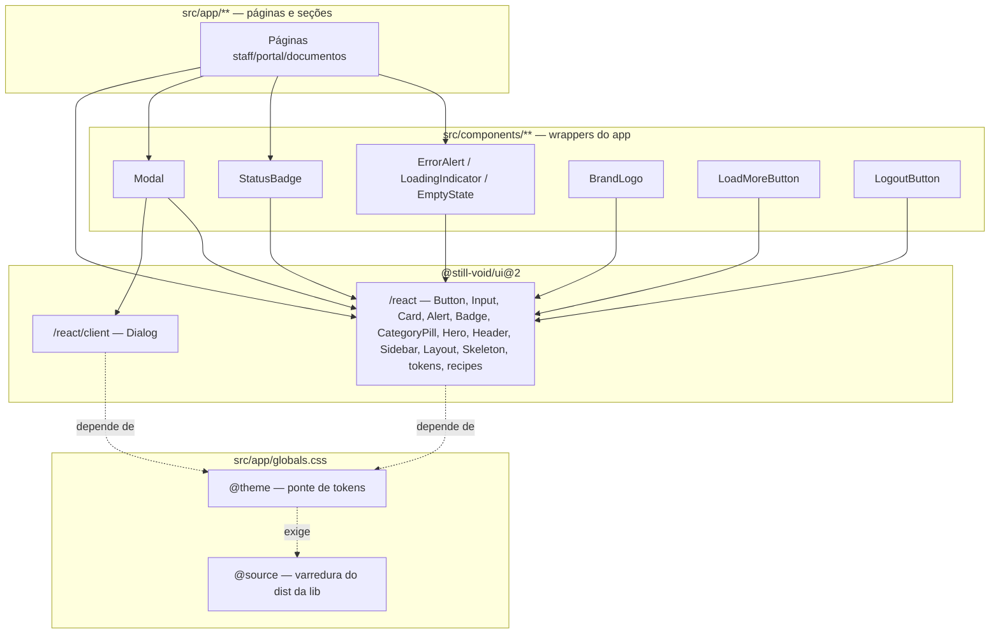

# Migração `@still-void/ui` 1.x → 2.0 + adoção do catálogo — Design

**Spec**: `.specs/features/still-void-v2-migration/spec.md`
**Status**: Approved (abordagem C + ponte na task 1, confirmadas pelo usuário em 2026-08-22)

---

## Pesquisa (Knowledge Verification Chain)

Fontes consultadas, em ordem, e o que cada uma decidiu:

| Passo | Fonte | Achado |
| --- | --- | --- |
| 1. Codebase | `src/app/globals.css` | O `@theme` já faz ponte semântica (`--color-accent`, `--color-ink`, …) **e** já sobrescreve as escalas `slate-*`/`teal-*` para tokens `--sv-*`. Logo `bg-teal-700` hoje **já é** `--sv-accent-ink`: o trabalho de paleta é renomeação, não recoloração. |
| 1. Codebase | inventário `grep` | 89 `<button>`, 71 `<input>`, 23 `<select>`, 7 `<textarea>`, 14 `<table>`, 65 divs-cartão, 35 `bg-white`, 44 `text-white`, 52 usos de `amber/emerald/sky` sem ponte. |
| 2. Docs do projeto | `.specs/STATE.md` | AD-001..AD-004 são de auth/sessão/imagem/programa. Nenhuma restringe camada de UI → **conformar sem supersede**. |
| 2. Docs do projeto | `AGENTS.md` | "This is NOT the Next.js you know" — checar `node_modules/next/dist/docs/` antes de mexer em convenção de App Router. Esta migração não muda roteamento, só componentes de folha. |
| 4. Docs da lib | `docs/migration-v1-to-v2.md` | Único breaking: entry `@still-void/ui` some. Nada renomeado exceto o **tipo** `ReadingProgress` → `ReadingProgressController` (o app não usa). |
| 4. Artefato publicado | `still-void-ui-2.0.0.tgz` | Export lines de `dist/react/index.d.ts` e `dist/react/client/index.d.ts` — fonte de verdade do catálogo (ver tabela abaixo). |

### Catálogo v2 verificado (contra a export line do tarball, não contra a doc)

**`@still-void/ui/react`** — `Alert`, `AlertDescription`, `AlertTitle`, `ArticleHeader`, `Badge`, `Button`, `Callout`, `Card`, `CardContent`, `CardDescription`, `CardFooter`, `CardHeader`, `CardSkeleton`, `CardTitle`, `CategoryPill`, `CodeBlock`, `FeaturedPostCard`, `Footer`, `Header`, `Hero`, `Input`, `Layout`, `Lead`, `Logo`, `PostCard`, `PostGrid`, `Prose`, `Sidebar`, `SidebarSection`, `Skeleton`, `ThemeScript` + todos os tokens e receitas.

**`@still-void/ui/react/client`** — `CopyButton`, família `Dialog`, família `DropdownMenu`, família `Select`, família `Tabs`, família `Tooltip`, `TableOfContents`, `ReadingProgress`, `ThemeProvider`, `ThemeToggle`, `useTheme`, `useScrollSpy`, `useReadingProgress`, `copyToClipboard`, `createThemeManager`, `createScrollSpy`, `createReadingProgress`.

> **Divergência documentada:** `docs/design-system.md` da lib anuncia a família `AlertDialog`,
> e `@radix-ui/react-alert-dialog` está em `dependencies` — mas **nenhum símbolo `AlertDialog`
> aparece na export line da `2.0.0`**. Tratado como ausente e listado como lacuna.

---

## Architecture Overview

Três camadas, de fora para dentro. A migração não move responsabilidade entre camadas — só
troca o fornecedor da folha.



---

## Abordagens consideradas

Todas entregam o mesmo escopo da spec; mudam só o *onde* o componente da lib é consumido.

### A — Camada de wrapper total (`src/components/ui/*`)

Cada primitivo da lib ganha um wrapper local (`AppButton`, `AppInput`, …) e as páginas nunca
importam a lib direto.

- ✅ Um só ponto para trocar de biblioteca no futuro; defaults do app centralizados.
- ❌ Indireção sem ganho hoje: 6 dos 9 wrappers seriam re-export puro. Contraria YAGNI e a
  regra de "abstração quando a repetição é real".

### B — Consumo direto da lib em todo call site

Páginas importam `Button`/`Input`/`Card` direto de `@still-void/ui/react`.

- ✅ Zero indireção, diff mais legível, o import diz de onde a peça vem.
- ❌ Perde o lugar natural para comportamento composto que o app já tem (focus trap, cor por
  status, estado de carregamento) — hoje resolvido em `src/components/`.

### C — Híbrido: direto para primitivo, wrapper só onde há comportamento ⭐ **recomendado**

Primitivos (`Button`, `Input`, `Card*`, `Badge`) vêm direto da lib nos call sites. Wrapper
local sobrevive **apenas** onde já existe comportamento além do estilo: `Modal` (sobre
`Dialog`), `StatusBadge` (sobre `CategoryPill`), `ErrorAlert` (sobre `Alert`), `BrandLogo`
(sobre a receita `logo()`, por causa do `next/link`), `LoadMoreButton`, `LogoutButton`.

- ✅ É exatamente a convenção que o repo **já** segue — `brand-logo.tsx`, `status-badge.tsx` e
  `feedback.tsx` são precisamente esse padrão, cada um com um comentário explicando por quê.
- ✅ Nenhum wrapper novo é criado; os existentes só trocam de miolo.
- ⚠️ Sem ponto único de troca de biblioteca — aceito: a lib é do mesmo autor e o custo real de
  um futuro swap é o `grep` de import, não a indireção.

**Recomendação: C.**

---

## A ponte Tailwind — o risco central desta migração

Os componentes shadcn da v2 **não** têm classe em `style.css`. Eles emitem utilitários
Tailwind no `className`, extraídos do `dist`:

```
bg-background  bg-destructive  bg-sv-border  bg-sv-signal-cyan  bg-sv-surface  bg-sv-surface-2
border-sv-border  ring-ring  ring-offset-background  text-accent  text-destructive-foreground
text-sv-bg  text-sv-text  text-sv-text-2
```

Dois pré-requisitos, ambos ausentes hoje:

1. **Os nomes precisam existir no `@theme`.** O bridge atual define `--color-surface`/`--color-ink`,
   e não `--color-sv-surface`/`--color-sv-text`. Sem os nomes exatos, `bg-sv-surface` não é
   utilitário conhecido e o `Button` sai sem fundo.
2. **O Tailwind v4 precisa varrer o `dist` da lib.** A detecção automática de conteúdo do v4
   respeita o `.gitignore`, e `node_modules` está ignorado — as classes que só existem dentro
   do pacote nunca chegam ao CSS gerado. Exige `@source` explícito.

O README da lib manda "configure your `tailwind.config.ts`", mas este projeto é Tailwind v4
CSS-first e **não tem** `tailwind.config.ts`. A tradução para v4 é `@source` + `@theme`.

> **Este pré-requisito é verificado empiricamente, não presumido:** a task que instala a ponte
> tem como gate a presença literal de `bg-sv-surface` no CSS emitido pelo `next build`.

---

## Code Reuse Analysis

### Componentes existentes a aproveitar

| Componente | Local | Como usar |
| --- | --- | --- |
| `Modal` | `src/components/modal.tsx` | Manter API pública; trocar miolo (focus trap manual + backdrop) por `Dialog`+`DialogContent`+`DialogTitle` da lib |
| `StatusBadge` | `src/components/status-badge.tsx` | Sem mudança — já usa `CategoryPill` de `/react` |
| `ErrorAlert` | `src/components/feedback.tsx` | Trocar `Callout kind="warn"` + override de CSS var por `Alert`+`AlertDescription` |
| `LoadingIndicator` | `src/components/feedback.tsx` | Sem mudança — já usa `CardSkeleton` de `/react` |
| `BrandLogo` | `src/components/brand-logo.tsx` | Só o path de import (`@still-void/ui` → `/react`); o wrapper existe por causa do `next/link` e continua justificado |
| `LoadMoreButton` | `src/components/load-more-button.tsx` | Trocar `categoryPill({interactive})` por `Button variant="outline" size="sm"` |
| `LogoutButton` | `src/components/logout-button.tsx` | Trocar `headerClasses.link` por `Button variant="ghost" size="sm"` |
| `PagedList` | `src/components/paged-list.tsx` | Sem mudança — orquestra estados, não pinta |
| `inputClass` (const duplicada) | 12 arquivos | **Deletar** — substituída por `<Input>` da lib |
| Ponte `@theme` | `src/app/globals.css:23` | Estender com os nomes que os componentes shadcn exigem |

### Pontos de integração

| Sistema | Método de integração |
| --- | --- |
| Tailwind v4 | `@source` apontando para `node_modules/@still-void/ui/dist` + chaves `--color-*` novas no `@theme` |
| Next 16 App Router | `Dialog` é client-only; entra apenas em `modal.tsx`, que já é `"use client"` — nenhuma fronteira nova |
| Vitest + jsdom | Radix Dialog pode exigir `ResizeObserver`/`PointerEvent`; polyfill vai em `tests/setup.ts`, nunca afrouxando asserção |
| Playwright (e2e) | Seletores por papel/rótulo continuam válidos: `Button` emite `<button>`, `Input` emite `<input>` |

---

## Components

### `globals.css` — ponte de tokens

- **Purpose**: fazer os utilitários que a lib emite existirem, e apagar o vocabulário de apelido.
- **Location**: `src/app/globals.css`
- **Interfaces**:
  - `@source "../../node_modules/@still-void/ui/dist"` — varredura do dist da lib
  - `@theme` ganha: `--color-sv-bg`, `--color-sv-surface`, `--color-sv-surface-2`, `--color-sv-text`, `--color-sv-text-2`, `--color-sv-text-3`, `--color-sv-border`, `--color-sv-signal-cyan`, `--color-background`, `--color-ring`, `--color-destructive`, `--color-destructive-foreground`
  - `@theme` **perde**: todo `--color-slate-*` e `--color-teal-*`
  - `@theme` ganha para o app: `--color-surface-2`, `--color-accent-soft`, `--color-accent-strong` (cobrem `teal-50/100` e `hover:bg-teal-800`, que não tinham nome semântico)
- **Dependencies**: `@still-void/ui/theme.css` (define os `--sv-*` de origem)
- **Reuses**: o bloco de ponte semântica que já existe nas linhas 23–46

### `Modal` — sobre `Dialog`

- **Purpose**: diálogo modal com a mesma API pública de hoje.
- **Location**: `src/components/modal.tsx`
- **Interfaces**: `Modal({ title: string, onClose: () => void, children: ReactNode })` — **inalterada**
- **Dependencies**: `Dialog`, `DialogContent`, `DialogHeader`, `DialogTitle` de `@still-void/ui/react/client`
- **Reuses**: os ~10 call sites não mudam; `tests/components/modal.test.tsx` é o contrato
- **Nota**: usado como `Dialog` controlado — `open` fixo em `true` (o call site já monta/desmonta o `Modal`), `onOpenChange` mapeado para `onClose`. Focus trap, Escape, backdrop e `aria-modal` passam a ser responsabilidade da Radix.

### Marcação `// sv-gap:`

- **Purpose**: amarrar cada workaround local que sobrevive à entrada correspondente em `docs/still-void-gaps.md`.
- **Location**: no ponto do código
- **Interfaces**: comentário `// sv-gap: <slug>` na linha acima do elemento cru
- **Dependencies**: `docs/still-void-gaps.md` tem uma seção com o mesmo `<slug>`
- **Reuses**: nada — é convenção nova, registrada como decisão de projeto

### `scripts/check-sv-adoption.sh`

- **Purpose**: transformar os critérios "zero ocorrência de X" da spec em gate executável.
- **Location**: `scripts/check-sv-adoption.sh`
- **Interfaces**: exit 0 quando limpo; exit 1 imprimindo `arquivo:linha` de cada achado
- **Checagens**: import bare da lib · `<button>`/`<input>` cru não marcado com `// sv-gap:` · utilitário `slate|teal|amber|emerald|sky-NNN` · `--color-slate-*`/`--color-teal-*` sobrevivente no `@theme` · símbolo client-only importado em arquivo sem `"use client"`
- **Dependencies**: `grep`, `bash`
- **Reuses**: os mesmos padrões de `grep` usados no inventário desta fase

### `docs/still-void-gaps.md`

- **Purpose**: backlog acionável de componentes para a lib.
- **Location**: `docs/still-void-gaps.md`
- **Interfaces**: uma seção por lacuna com `slug`, motivo, nº de call sites, arquivos de exemplo, workaround atual, esboço de API sugerida
- **Dependencies**: inventário desta fase; export line da `2.0.0` como prova de ausência

---

## Mapa de substituição

| Padrão hoje | Vai para | Call sites | Requisito |
| --- | --- | --- | --- |
| `<button className="rounded-lg bg-teal-700 …">` | `<Button>` | 43 primários | SV2-04 |
| `<button className="rounded-lg border …">` | `<Button variant="outline">` | ~20 secundários | SV2-04 |
| `<button className={headerClasses.link}>` | `<Button variant="ghost">` / `variant="link"` | ~8 | SV2-04 |
| `<input className={inputClass}>` | `<Input>` | 71 (menos checkbox/radio/file) | SV2-05 |
| `<Callout kind="warn">` no `ErrorAlert` | `<Alert>` + `<AlertDescription>` | 1 wrapper, ~25 usos | SV2-06 |
| focus trap manual no `Modal` | `<Dialog>` da lib | 1 wrapper, ~10 usos | SV2-07 |
| `<div className="rounded-xl border … bg-white">` | `<Card>` (+ `CardHeader`/`CardTitle`/`CardContent`) | 65 | SV2-08 |
| `<select>` nativo | **fica** + `// sv-gap: native-select` | 23 | SV2-11 |
| `<textarea>` | **fica** + `// sv-gap: textarea` | 7 | SV2-11 |
| `<table>` | **fica** + `// sv-gap: table` | 14 | SV2-11 |
| `<input type="checkbox">` | **fica** + `// sv-gap: checkbox` | inventariar | SV2-11 |
| `slate-*` / `teal-*` | `bg`/`surface`/`ink*`/`border*`/`accent*` | 435 | SV2-12 |
| `amber-*` / `emerald-*` / `sky-*` | `warning` / `success` / `info` | 52 | SV2-13 |
| `bg-white` / `text-white` | `bg-surface` / `text-sv-bg` conforme papel | 79 | SV2-13 |

---

## Error Handling Strategy

| Cenário | Tratamento | Impacto no usuário |
| --- | --- | --- |
| `bg-sv-surface` ausente do CSS gerado após a ponte | Gate da task falha antes do commit; corrige-se o `@source` | Nenhum — não chega a merge |
| Radix Dialog quebra em jsdom | Polyfill em `tests/setup.ts`; **nunca** afrouxar asserção de `modal.test.tsx` | Nenhum |
| `className` do app não vence o do `Button` | `tailwind-merge` (dep da lib) já resolve conflito de utilitário a favor do último | Nenhum |
| Um `<button>` cru é semanticamente correto (célula de grade) | Marcar `// sv-gap:` + entrada no doc, em vez de forçar `<Button>` | Nenhum |
| Cobertura cai abaixo de 90% ao deletar branch de estilo | Gate do `npm test` falha; ajusta-se o teste do componente tocado | Nenhum |

---

## Risks & Concerns

| Concern | Local | Impacto | Mitigação |
| --- | --- | --- | --- |
| Componentes shadcn da lib dependem de nomes de utilitário que o app não define, e o Tailwind v4 não varre `node_modules` | `src/app/globals.css:23` | `Button`/`Card`/`Input`/`Alert`/`Badge` renderizam sem estilo — regressão visual silenciosa, invisível para teste unitário | Task dedicada e **primeira** na ordem, com gate empírico: `bg-sv-surface` literal no CSS de `next build` |
| `inputClass` duplicada em 12 arquivos com valores levemente diferentes | vários (`patient-form.tsx:22`, `procedimentos/page.tsx:12`, …) | Deriva de estilo; a troca por `<Input>` pode alterar altura/padding de campo | Migrar arquivo a arquivo com o teste de página do arquivo como gate |
| `docs/design-system.md` da lib diverge do artefato publicado (`AlertDialog`) | doc da lib | Desenhar contra API inexistente | Catálogo derivado da export line do tarball; divergência registrada na spec e no doc de lacunas |
| Cobertura exige ≥90% em `src/app/**` e `src/components/**` | `vitest.config.ts:60` | Deletar branches de estilo mexe no denominador | `npm test` é gate de toda task |
| Camada de autorização (`src/proxy.ts`, rotas) é a parte sensível do projeto e **não** é tocada aqui | — | — | Escopo restrito a `.tsx` de apresentação, `globals.css`, `package.json` e docs. Nenhum arquivo de `src/lib/auth`, `src/domain`, `src/application`, `src/infrastructure` ou `src/proxy.ts` entra no diff |
| Lição candidata L-004 (critério de UI sem dizer onde é satisfeito) | `.specs/LESSONS.md` | Verificador não consegue provar um AC | Todo AC desta spec é asserção estática de código-fonte ou teste de comportamento em componente nomeado |

---

## Tech Decisions

| Decisão | Escolha | Racional |
| --- | --- | --- |
| Onde consumir a lib | Abordagem C (híbrida) | Já é a convenção do repo; não cria indireção sem uso |
| Ponte Tailwind | `@source` + `@theme` em `globals.css` (CSS-first do v4) | O projeto não tem `tailwind.config.ts`; o README da lib assume v3 |
| Fonte de verdade do catálogo | Export line do tarball `2.0.0` | A doc da lib diverge (`AlertDialog`); artefato vence documento |
| `Modal` sobre `Dialog` | Wrapper mantém a API | Evita tocar ~10 call sites e preserva o teste de a11y existente como contrato |
| Workarounds sobreviventes | Comentário `// sv-gap: <slug>` | Torna a lacuna verificável por `grep` e liga código ↔ backlog da lib |
| Gate de adoção | `scripts/check-sv-adoption.sh` | Critério "zero ocorrências" precisa ser executável, não inspeção visual |

> **Nível de projeto:** a convenção `// sv-gap:` e a regra "todo utilitário de cor resolve para
> um `--sv-*`" valem para features futuras → viram `AD-005` e `AD-006` em `.specs/STATE.md`.
