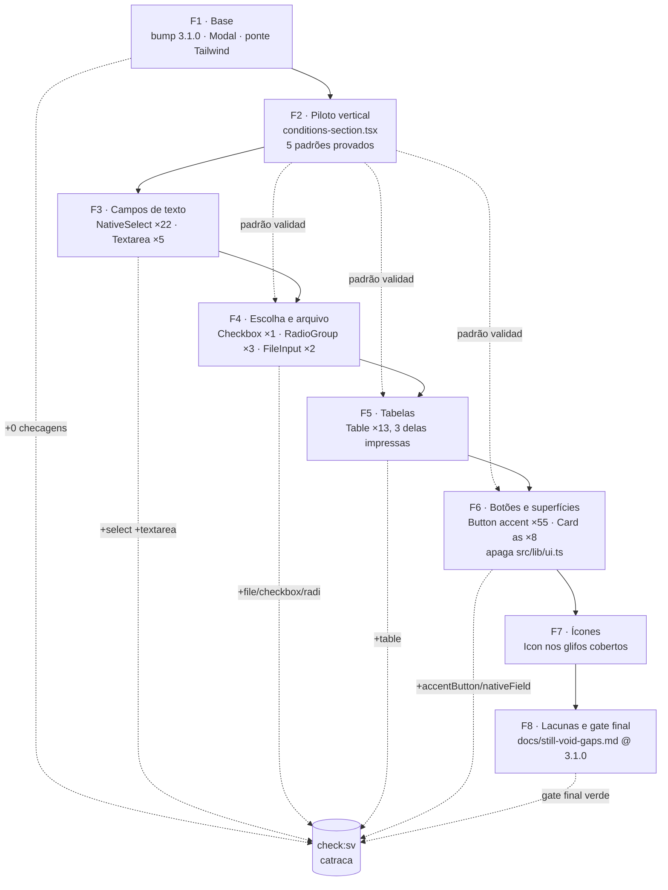

# Migração `@still-void/ui` 2.0.1 → 3.1.0 — Design

**Spec**: `.specs/features/still-void-v3-migration/spec.md`
**Status**: Draft

---

## Pesquisa (Knowledge Verification Chain)

Passo 1 (codebase) e passo 2 (docs do projeto) responderam tudo; **nenhum passo 4 ou 5
foi necessário**. A fonte de verdade sobre a `3.1.0` é o tarball publicado
(`npm pack @still-void/ui@3.1.0`), não a documentação da lib — regra herdada da
migração v2, onde `docs/design-system.md` anunciava `AlertDialog` que o artefato não
exportava.

Achados que mudam o desenho:

| Achado | Evidência | Consequência |
| --- | --- | --- |
| A `3.1.0` **não emite nenhuma classe Tailwind** no `dist` | busca por `bg-`/`text-`/`ring-`/`shadow-` em `dist/react/*.js` → vazio | `@source "…/@still-void/ui/dist"` passa a varrer alvo vazio: pode sair |
| `Button` compõe `cn("sv-btn", variant…, className)` | `dist/react/index.js` | `className` do app sobrevive; utilitário Tailwind vence `layer(components)` |
| `.sv-card` define borda, raio (`--sv-radius-md`) e superfície, **sem padding** | `dist/style.css` | O `p-4`/`p-5` dos call sites sobrevive intacto |
| `Icon` já resolve o contrato de acessibilidade | `dist/react/index.js`: sem `label` → `aria-hidden="true"`; com `label` → `role="img"` + `aria-label` | O AC de rótulo não exige código do app, só a escolha certa de `label` |
| `Table` renderiza `<div class="sv-table-container">` em volta do `<table>` | `dist/react/index.js` | Muda a árvore DOM; os `<Card className="overflow-x-auto">` que hoje embrulham tabela ficam redundantes |
| `.sv-table__th/__td/__row` pintam com `--sv-border`, `--sv-text-3`, `--sv-surface-2` | `dist/style.css` | Conflita com a folha de impressão de `src/app/documentos/**` (AD-006) |
| `RadioGroup` injeta `name` só em **filho direto** | `dist/react/index.js` | Os 3 grupos de `care-plans-section.tsx`, que aninham o `<input>` dentro de `<label>`, precisam de reestruturação real |
| `DialogContent` tem só `showCloseButton`, sem prop de rótulo | `dist/react/client/index.d.ts` + `"Close dialog"` literal no `.js` | AD-015: o app mantém o botão próprio |
| `--sv-space-1` = `4px`; default do Tailwind v4 = `0.25rem` | `dist/theme.css` | `--spacing: var(--sv-space-1)` do `tailwind.css` é no-op com raiz de 16px |

---

## Conformidade com as decisões ativas (`.specs/STATE.md`)

| Decisão | Como este design conforma |
| --- | --- |
| **AD-005** (`sv-gap:` pareado com `docs/still-void-gaps.md`, gate nos dois sentidos) | Cada fase que apaga um workaround apaga a marcação **e** a seção no mesmo commit. Duas entradas novas nascem já pareadas: `icon-set-gaps` (marcada no código) e `dialog-close-label` (`sv-gap-doc-only`, é relato sobre a lib — o app não tem workaround, tem configuração). |
| **AD-006** (toda cor resolve para `--sv-*`; neutro literal só em impressão, com comentário) | A ponte semântica do app fica intacta. As 3 tabelas de `documentos/**` migram para `Table` **com override neutro** e mantêm o comentário que explica por quê. |
| **AD-007** (`--max-old-space-size=4096` no build) | Não tocado. O pico de build tende a cair, já que o CSS gerado encolhe. |
| **AD-013** (achado de scanner só vira trabalho depois de reproduzido) | A fase base confronta `npm audit`/`npm ls` contra o baseline de `fcd6110` antes de aceitar qualquer achado novo vindo das 6 dependências que entram na árvore. |
| **AD-014** (port, não redesign) | Nenhum padrão de UI novo. `Badge`, `fieldMessage`, `AlertDialog`, `Tabs`, `Tooltip`, `DropdownMenu` ficam fora. |
| **AD-015** (`Modal` mantém botão pt-BR) | `showCloseButton={false}` na fase base. |

Nenhuma decisão ativa precisa ser superseded.

**Lições confirmadas aplicadas:** L-011 (relatório de scanner pode citar versão que não
existe na árvore — confrontar com `npm ls`/`npm audit`) governa o critério SV3-14.

---

## Architecture Overview

Abordagem escolhida com o usuário: **híbrido piloto + horizontal**. Uma fase base
estabelece a plataforma, uma fase piloto prova os cinco padrões de troca num arquivo
real e denso, e as fases seguintes replicam o padrão já validado, primitivo a primitivo.

O gate `scripts/check-sv-adoption.sh` é o mecanismo de catraca: **cada fase termina
adicionando a checagem que ela acabou de tornar satisfazível**. Assim o gate está
verde em todo commit (SV3-12) e ainda assim é impossível regredir um primitivo já
portado.



### Por que o piloto é `conditions-section.tsx`

É o arquivo mais denso do inventário — 4 `<select>`, 2 `<textarea>`, 1 `<table>`,
4 `accentButton`, 7 `nativeField` e 1 `card-as-element` — e já tem suíte de
comportamento (`tests/pages/staff-paciente-detail.test.tsx`, 51 KB). Um único arquivo
exercita cinco dos seis padrões de troca antes de qualquer replicação em massa.

---

## Code Reuse Analysis

### O que já existe e é aproveitado

| Componente | Localização | Como é usado |
| --- | --- | --- |
| `scripts/check-sv-adoption.sh` | `scripts/` | Estendido, não reescrito: 5 checagens novas seguindo o mesmo `report()`/`tsx_files()`/`awk` com guarda de comentário |
| `tests/scripts/check-sv-adoption.test.ts` | `tests/scripts/` | Estendido com fixture por checagem nova (prova que **acha** antes de aprovar ausência) |
| `docs/still-void-gaps.md` | `docs/` | Reescrito para a `3.1.0`, mantendo formato, prova-de-ausência e a convenção `sv-gap-doc-only` |
| Suítes por página (`tests/pages/*.test.tsx`, 12 arquivos) | `tests/pages/` | Rede de segurança de comportamento: cada fase roda a suíte das páginas que tocou |
| `e2e/*.spec.ts` (17 specs, 64 casos) | `e2e/` | Validação de fluxo de ponta a ponta por fase |
| `src/components/modal.tsx` | `src/components/` | Único wrapper local que sobrevive: adiciona `showCloseButton={false}` e mantém restauração de foco e `aria-modal` |
| Ponte semântica do `@theme` (AD-006) | `src/app/globals.css` | Preservada integralmente; só o bloco `--color-sv-*` duplicado sai |

### O que deixa de existir

| Artefato | Motivo |
| --- | --- |
| `src/lib/ui.ts` (arquivo inteiro) | `nativeField` → `Textarea`/`NativeSelect`/`FileInput`/`Checkbox`; `accentButton` → `Button variant="accent"` |
| `@source "../../node_modules/@still-void/ui/dist"` | A `3.1.0` não emite classe Tailwind nenhuma no `dist` |
| Bloco `--color-sv-*` copiado à mão no `@theme` | Substituído por `@import "@still-void/ui/tailwind.css"` |
| `--color-background`, `--color-ring`, `--color-destructive`, `--color-destructive-foreground` | Únicos consumidores eram `ring-ring`/`ring-offset-background` dentro de `nativeField` |
| 14 seções de `docs/still-void-gaps.md` | Fechadas pela `3.1.0`, conferidas contra a export line |

### Nenhuma camada local nova

Não se cria barrel `src/components/ui/*` re-exportando o catálogo. Esta migração
existe justamente para **apagar** a camada local (`src/lib/ui.ts`); criar outra
reintroduziria o mesmo acoplamento com outro nome. Import direto de
`@still-void/ui/react` em cada call site, como já é a convenção do app.

---

## Components

### `NativeSelect` — substituto dos 23 `<select>`

- **Purpose**: campo `<select>` do catálogo, server-safe, serializa em `FormData`.
- **Location**: call sites em 13 arquivos (ver matriz na spec).
- **Interface**: `React.SelectHTMLAttributes<HTMLSelectElement>` — spread total.
- **Padrão de troca**:
  `<select className={nativeField} …>` → `<NativeSelect …>`; `className` some porque a
  classe agora vem do componente. Atributos de validação (`name`, `required`,
  `disabled`, `value`/`defaultValue`, `onChange`) e os `<option>` filhos vão intactos.
- **Reuses**: `field({ variant: 'select' })` internamente — o app não chama a receita.

### `Textarea` — substituto dos 7 `<textarea>`

- **Interface**: `React.TextareaHTMLAttributes<HTMLTextAreaElement>`.
- **Padrão de troca**: idêntico ao `NativeSelect`. `rows` continua valendo;
  `.sv-field--textarea` já traz `min-height` de 2 linhas e `resize: vertical`.

### `Checkbox`, `RadioGroup`/`RadioGroupItem`, `FileInput`

- **`Checkbox`** (1 call site, `materiais/page.tsx:378`): `<input type="checkbox">` cru
  dentro de `<label className="flex items-center gap-2">` → `<Checkbox>` dentro do
  mesmo `<label>`, que pode adotar `fieldClasses.choice` (`sv-choice`). `checked` e
  `onChange` inalterados.
- **`RadioGroup`** (3 grupos, `care-plans-section.tsx:636,879,935`): **é o único ponto
  com mudança estrutural real.** Hoje cada `<input type="radio">` vive dentro de um
  `<label>`, ou seja, é neto do `<fieldset>` — e o `RadioGroup` só injeta `name` em
  filho direto. Forma alvo:

  ```tsx
  <RadioGroup legend="Tipo de diagnóstico" legendHidden name="diagnosis-type" orientation="horizontal">
    {options.map((o) => (
      <RadioGroupItem key={o} value={o} checked={type === o} onChange={() => setType(o)}>
        {CARE_PLAN_DIAGNOSIS_TYPE_LABELS[o]}
      </RadioGroupItem>
    ))}
  </RadioGroup>
  ```

  O rótulo passa de irmão-dentro-do-`<label>` para `children` do item, e o
  `<legend className="sr-only">` vira `legend` + `legendHidden`.
- **`FileInput`** (2 call sites): substitui o par `<label>` + `<input type="file"
  className="hidden">`. **Única mudança visual planejada** (aprovada): a afordância
  deixa de ser um link "+ Adicionar foto" e passa a ser o controle de arquivo com
  `::file-selector-button` estilizado. `accept`, `disabled`, `onChange` e o reset
  `e.target.value = ""` são preservados.

### Família `Table` — substituta das 14 tabelas

- **Padrão de troca**: `<table>` → `Table`, `<thead>` → `TableHeader`, `<tbody>` →
  `TableBody`, `<tr>` → `TableRow`, `<th>` → `TableHead`, `<td>` → `TableCell`.
  As classes de decoração repetidas em 12 arquivos (`border-b bg-bg text-xs uppercase
  text-ink-3`, `divide-y divide-border`) **saem** — é exatamente o que `.sv-table__th`
  e `.sv-table__row` já emitem.
- **Efeito colateral a tratar**: onde um `<Card className="overflow-x-auto">` existe só
  para dar rolagem à tabela (`faturamento/page.tsx:227`, `parceiros/page.tsx:50`), o
  `overflow-x-auto` sai — `sv-table-container` já rola.
- **Caso de impressão** (`documentos/plano-cuidados/[carePlanId]/page.tsx` ×2,
  `documentos/relatorio/[conditionId]/page.tsx` ×1): usa a família **com override
  neutro** no `className` (`border-black`, `text-black`), preservando a folha em
  preto. O utilitário vence `layer(components)`, então o override é determinístico, e
  o comentário exigido por AD-006 permanece no ponto.

### `Button variant="accent"` — substituto dos 59 `accentButton`

- **Padrão de troca**: `<Button className={accentButton}>` → `<Button variant="accent">`.
  Onde havia `className={\`${accentButton} w-full\`}` ou similar, o resto do `className`
  fica: `<Button variant="accent" className="w-full">`.
- **Risco controlado**: `variant="accent"` pinta `background: var(--sv-accent-ink)` /
  `color: var(--sv-bg)`, e a receita local pintava `bg-accent-ink text-sv-bg` — mesmos
  tokens. O `hover` muda de `bg-accent-strong` (mistura local com preto) para o hover
  do catálogo; é a única diferença de valor e é intencional (a mistura local existia
  para simular a variante que agora existe).

### `Card as` / `asChild` — substituto dos 9 `card-as-element`

- **Padrão de troca**: `<section className="rounded-lg border border-sv-border
  bg-sv-surface p-5">` → `<Card as="section" className="p-5">`; `<li className="rounded-lg
  border border-sv-border bg-sv-surface p-4">` → `<Card as="li" className="p-4">`.
- **Caso especial** (`portal/consent-card.tsx:62`): a superfície é de alerta
  (`border-warning bg-warning-soft`), não de cartão. Vira
  `<Card as="section" className="border-warning bg-warning-soft p-4">` — o utilitário
  sobrescreve a borda e o fundo do `.sv-card`, e o elemento continua sendo `<section>`.
  Não vira `Alert`: seria adotar padrão novo, vetado por AD-014.

### `Icon` — substituto dos glifos cobertos

- **Mapa de troca**: `✕`→`x` (1), `⚠`→`alert-triangle` (3), `✓`→`check-circle` (1),
  `←`/`→` **quando afordância de navegação**→`chevron-left`/`chevron-right`.
- **Classificação obrigatória de `←`/`→`** (3 + 11 ocorrências): só vira ícone o que é
  controle. `"Triagem → Consulta"` em texto corrido continua sendo texto.
- **Acessibilidade**: `label` **só** quando o ícone é a única informação do controle —
  o componente já resolve `aria-hidden`/`role="img"` sozinho.
- **Não cobertos**: `📷`, `⛔`, `⏳` ficam, marcados `sv-gap: icon-set-gaps`. `−` e `≤`
  são notação matemática em texto e **não** são marcados.

### `scripts/check-sv-adoption.sh` — a catraca

- **Purpose**: transformar cada "zero ocorrências" da spec em verificação executável.
- **Interface**: mesma de hoje — `check-sv-adoption.sh [SRC] [GAPS_DOC]`, saída 0/1.
- **Checagens novas** (adicionadas **na fase que as torna satisfazíveis**, nunca antes):

  | # | Checagem | Baseline pré-migração | Entra na fase |
  | --- | --- | --- | --- |
  | 8 | `<select>` cru | 23 | F3 |
  | 9 | `<textarea>` cru | 7 | F3 |
  | 10 | `<input type="file\|checkbox\|radio">` cru | 6 | F4 |
  | 11 | `<table>` cru | 14 | F5 |
  | 12 | `accentButton` / `nativeField` / existência de `src/lib/ui.ts` | 59 / 45 / 1 | F6 |

  Todas herdam a guarda de comentário (`prev !~ /sv-gap:/` e pulo de linha de prosa)
  que as checagens [2] e [3] já usam, para que `<table>` citado em JSDoc não vire achado.
- **Reuses**: `report()`, `tsx_files()` e o formato de cabeçalho com baseline registrado.

---

## Data Models

Nenhum. A migração não toca schema, DTO, domínio ou persistência — o diff é
`src/app/**/*.tsx`, `src/components/*.tsx`, `src/app/globals.css`, `package.json`,
`scripts/` e `docs/`.

---

## Error Handling Strategy

| Cenário de erro | Tratamento | Impacto no usuário |
| --- | --- | --- |
| Símbolo esperado ausente na `3.1.0` | A prova é a export line do artefato, conferida **antes** da task; se faltar, a lacuna volta ao documento em vez de o código ser inventado | Nenhum — pega na fase de design/task |
| `RadioGroup` sem exclusividade por item aninhado | Teste de comportamento em `staff-paciente-care-plans.test.tsx`: selecionar B desmarca A | Nenhum — falha vermelha antes do commit |
| Página quebra depois da troca | Suíte da página + e2e da área rodam na própria fase; commit atômico permite reverter uma fase | Nenhum em produção |
| Folha de impressão herda cor de tema | Asserção estática: o markup dos 3 documentos não contém classe de token de tema | Nenhum |
| `npm audit` ganha HIGH/CRITICAL das 6 dependências novas | Reproduzir com `npm ls`/`npm audit` local antes de agir (AD-013, L-011) | Nenhum |
| Gate vermelho no meio da migração | Impossível por construção: a checagem só entra na fase que a satisfaz | — |

---

## Risks & Concerns

| Concern | Location | Impact | Mitigation |
| --- | --- | --- | --- |
| **Rádios aninhados dentro de `<label>`** — `RadioGroup` só injeta `name` em filho direto; uma troca literal produziria rádios não-exclusivos que ainda **renderizam bem** | `src/app/(staff)/pacientes/[id]/care-plans-section.tsx:636,879,935` | Bug silencioso de formulário clínico: dois diagnósticos marcados ao mesmo tempo | Reestruturação obrigatória (rótulo vai para `children` do item) + AC de comportamento SV3-15, asserido em `tests/pages/staff-paciente-care-plans.test.tsx` |
| **Tabela de impressão herda tokens de tema** | `src/app/documentos/plano-cuidados/[carePlanId]/page.tsx:81,112`; `src/app/documentos/relatorio/[conditionId]/page.tsx` | Documento clínico impresso sai cinza-sobre-cinza em impressora P&B; contraria AD-006 | `Table` com override neutro no `className` + asserção estática de ausência de classe de token no markup dos 3 documentos |
| **`conditions-section.tsx` e `care-plans-section.tsx` são arquivos grandes** com 5 primitivos misturados e estado local denso | `src/app/(staff)/pacientes/[id]/conditions-section.tsx` (7 `nativeField`, 4 `select`); `…/care-plans-section.tsx` (>950 linhas) | Diff grande e difícil de revisar; alto risco de regressão silenciosa | O piloto (F2) isola o primeiro deles numa fase própria; o segundo é tocado por fases horizontais estreitas, cada uma de um único tipo |
| **`Table` insere um `<div>` na árvore** | 14 call sites | Seletor de teste ou CSS que dependa de `<table>` ser filho direto quebra | Suítes de página rodam por fase; a árvore alvo é conhecida (`div.sv-table-container > table`) |
| **Tokens `--color-ring`/`--color-background` removidos cedo demais** quebrariam `nativeField` | `src/app/globals.css`; `src/lib/ui.ts:29` | Build verde, campo sem anel de foco (falha WCAG 2.4.7 silenciosa) | A remoção desses 4 tokens é deliberadamente adiada para F6, o commit que apaga `src/lib/ui.ts` |
| **`hover` do botão primário muda de valor** | 59 call sites | Diferença visual sutil no hover da ação primária | Declarada como exceção conhecida nas Tech Decisions; é o comportamento do catálogo que a receita local imitava |
| **6 dependências novas entram na árvore sem call site** (`@heroicons/react` + 5 Radix) | `package-lock.json` | Superfície de supply chain maior; `npm audit` pode acusar | SV3-14: confronto contra o baseline de `fcd6110` com `npm ls`/`npm audit` (AD-013, L-011) |
| **`src/app/documentos/**` não tem suíte de página** (só `e2e/documentos.spec.ts`) | `tests/pages/` | A troca de tabela nos 3 documentos fica coberta só por e2e | F5 acrescenta asserção estática do markup neutro; o e2e de documentos roda na fase |

---

## Tech Decisions

| Decisão | Escolha | Racional |
| --- | --- | --- |
| Sequenciamento | Híbrido: base → piloto vertical → horizontal por primitivo → limpeza | Escolha do usuário. O piloto prova os 5 padrões num arquivo real antes de replicar em 25; o resto do diff fica homogêneo e mecânico |
| Catraca do gate | Cada fase adiciona a checagem que ela torna satisfazível | Mantém `check:sv` verde em todo commit (SV3-12) sem abrir mão da irreversibilidade |
| Camada local | Nenhuma — import direto do pacote | Criar `src/components/ui/*` seria trocar `src/lib/ui.ts` de nome em vez de apagá-lo |
| Raio do cartão nos 9 pontos migrados | Adotar `--sv-radius-md` (8px) do `.sv-card`, largando o `rounded-lg` (12px) escrito à mão | O app já renderiza 23 `<Card>` sem nenhum `rounded-lg`/`rounded-md` no `className` (conferido por varredura) — ou seja, já em 8px. Hoje as duas famílias divergem; a migração converge para o valor que já é maioria. Não é redesign, é fim de uma inconsistência |
| `hover` da ação primária | Aceitar o hover do catálogo | `bg-accent-strong` era mistura local imitando a variante ausente; existindo `variant="accent"`, imitar de novo seria manter a dívida |
| Tabelas de impressão | `Table` + override neutro no `className` | Escolha do usuário. Utilitário vence `layer(components)`; o gate chega a zero `<table>` cru e a folha continua preta |
| `consent-card` continua `Card`, não `Alert` | `Card as="section"` com override de cor de alerta | Adotar `Alert` seria padrão novo, vetado por AD-014 |
| Remoção dos 4 tokens órfãos do `@theme` | Adiada para F6 | Antes disso `nativeField` ainda depende de `ring-ring` e `ring-offset-background` |
| `--spacing: var(--sv-space-1)` herdado do `tailwind.css` | Aceito sem compensação | 4px absolutos vs `0.25rem` do default — idêntico com raiz de 16px, que é o caso do app |

> Nenhuma decisão desta tabela é project-level nova: as duas que fixam convenção
> (AD-014 port-não-redesign e AD-015 botão de fechar) já foram registradas em
> `.specs/STATE.md` na fase de Specify.

---

## Rastreabilidade requisito → fase

| Fase | Requisitos |
| --- | --- |
| F1 Base | SV3-01, SV3-02, SV3-03, SV3-14, SV3-20, SV3-21 |
| F2 Piloto (`conditions-section.tsx`) | SV3-04, SV3-05, SV3-08, SV3-09, SV3-11, SV3-13, SV3-17 (parciais) |
| F3 Campos de texto | SV3-04, SV3-05, SV3-11, SV3-16 |
| F4 Escolha e arquivo | SV3-06, SV3-11, SV3-15, SV3-16 |
| F5 Tabelas | SV3-08, SV3-16 |
| F6 Botões e superfícies | SV3-07, SV3-09, SV3-17, SV3-16 |
| F7 Ícones | SV3-18, SV3-19 |
| F8 Lacunas e gate final | SV3-10, SV3-16 |
| Transversal (todo commit) | SV3-12, SV3-13 |
