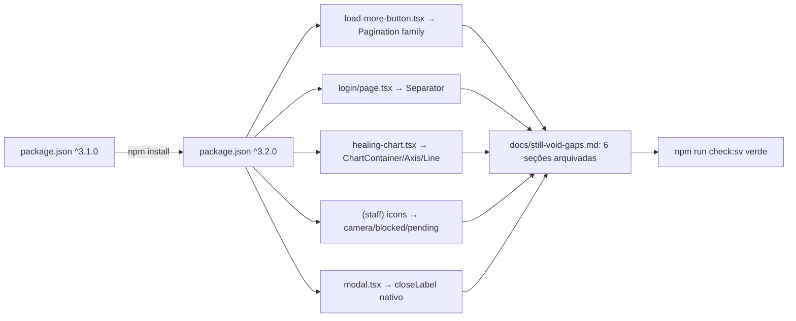

# Migração `@still-void/ui` 3.1.0 → 3.2.0 — Design

**Spec**: `.specs/features/still-void-v3.2-migration/spec.md`
**Status**: Approved

---

## Architecture Overview

Sem camada nova nem componente próprio. É substituição pontual, arquivo por
arquivo, do markup manual pelo artefato equivalente da `3.2.0` — mesmo padrão
de `still-void-v3-migration`. Verificado direto no artefato publicado
(`dist/react/index.js`, `dist/react/client/index.js` do tarball `3.2.0`), não
na documentação — API confirmada em runtime, não só em `.d.ts`.



---

## Code Reuse Analysis

### Existing Components to Leverage

| Component | Location | How to Use |
| --- | --- | --- |
| `Button variant="outline"` (removido) | `src/components/load-more-button.tsx` | Substituído por `Pagination`/`PaginationContent`/`PaginationItem`/`PaginationNext` — nenhum novo componente próprio |
| `toPoints`/`buildChartModel`/`xOf` | `src/components/healing-chart.tsx` | Mantidos integralmente — continuam calculando pixel space; só a camada de renderização SVG troca |
| Padrão "ícone decorativo ao lado de texto" | `src/app/(staff)/page.tsx:124`, `materiais/page.tsx:137` (`<Icon name="alert-triangle" />`) | Mesmo padrão replicado para `camera`/`blocked`/`pending` — sem prop `label` |

### Integration Points

| System | Integration Method |
| --- | --- |
| `scripts/check-sv-adoption.sh` checagem [7] | Consome `docs/still-void-gaps.md` via regex `^### \`slug\`` — seções fechadas saem desse formato para não exigir marcação `sv-gap:` residual no código |
| `.specs/STATE.md` Decisions | AD-015 marcado `superseded by AD-016`; AD-016 novo documenta `closeLabel="Fechar"` |

---

## Components

### `LoadMoreButton` (`src/components/load-more-button.tsx`)

- **Purpose**: mesmo botão "carregar mais" (cursor, sem índice de página), agora com landmark de paginação semântico
- **Interfaces**: prop pública inalterada — `{ visible: boolean; onClick: () => void }`
- **Markup novo**:
  ```tsx
  <Pagination className="mt-4">
    <PaginationContent className="justify-center">
      <PaginationItem>
        <PaginationNext label="Carregar mais" onClick={onClick} />
      </PaginationItem>
    </PaginationContent>
  </Pagination>
  ```
- **Por que sobrevive ao teste sem mudança de asserção de role/nome**: `PaginationNext` usa `label` tanto como `aria-label` quanto como texto visível (`dist/react/index.js:883-898`); accessible name computation prioriza `aria-label` — `getByRole("button", {name:"Carregar mais"})` casa igual. Só a classe muda (`sv-btn--outline` → `sv-pagination__link--next`).
- **Reuses**: nada de `src/lib/ui.ts` (já apagado na v3)

### `HealingChart` (`src/components/healing-chart.tsx`)

- **Purpose**: mesmo gráfico SVG de tendência, camada de primitivos em vez de tags cruas onde a lib cobre
- **Troca**:
  - `<svg role="img" aria-label="...">` → `<ChartContainer width={640} height={180} aria-label="Gráfico de evolução da condição">` (o `role="img"` é hardcoded dentro do componente — `dist/react/index.js:905-919` — sobrevive sem prop extra)
  - `<line>` de base → `<g transform="translate(${PAD_LEFT}, ${HEIGHT - PAD_BOTTOM})"><ChartAxis orientation="bottom" ticks={[]} length={WIDTH - PAD_LEFT - PAD_RIGHT} /></g>`
  - as 3 `<polyline>` de série → 3 `<ChartLine points={...} color={...} />` (precisa adaptar `toPoints` para devolver `{x,y}[]` em vez de string `"x,y x,y"`, já que `ChartLine` monta a string internamente)
  - círculos de dado (`<circle>`), textos de série (`áreaMax mm²`, `dor /10`) e datas min/max continuam manuais, como filhos diretos de `ChartContainer` — sem primitivo equivalente na lib
- **CSS novo**: classe `.healing-chart__pain-line` em `globals.css` com `stroke-width: 1.5; stroke-dasharray: 4 3;`, passada via prop `className` do `ChartLine` da série de dor — `ChartLine` fixa `strokeWidth={2}` inline (`dist/react/index.js:973-982`), e CSS de maior especificidade sobrepõe presentation attribute SVG
- **Reuses**: `formatDate`, `buildChartModel`, constantes de padding — tudo mantido

### `login/page.tsx` — `ProviderButtons`

- **Purpose**: mesmo divisor "ou" entre Google e senha
- **Troca**: os dois `<span className="h-px flex-1 bg-surface-2" />` → um único `<Separator decorative={false} className="flex-1" />` (a lib desenha a linha; `decorative={false}` expõe `role="separator"` porque o divisor tem significado real — dois métodos de login distintos, não um espaçador visual)
- Texto "ou" continua como nó de texto solto no mesmo `<div>` flex, fora do `Separator`

### `(staff)/page.tsx` e `(staff)/materiais/page.tsx` — ícones

- **Purpose**: substituir glifo Unicode por `Icon` do catálogo
- **Troca**: `📷 Fotos...` → `<Icon name="camera" /> Fotos...`; `⛔ {n} lote(s)...` → `<Icon name="blocked" /> {n} lote(s)...`; `⏳ {n} lote(s)...` → `<Icon name="pending" /> {n} lote(s)...` — sem `label` (decorativo, texto adjacente já anuncia)
- `Icon` já importado nos dois arquivos — sem novo import

### `Modal` (`src/components/modal.tsx`)

- **Purpose**: fechar `dialog-close-label` usando a prop nativa em vez de desabilitar o botão do pacote
- **Troca**: remove `showCloseButton={false}`, remove `<DialogClose aria-label="Fechar">...</DialogClose>` manual e o import de `Icon`; `DialogContent` ganha `closeLabel="Fechar"`
- **Ripple confirmado em runtime** (`dist/react/client/index.js:519-522`): o nome acessível do botão nativo vem de um `<span className="sv-sr-only">{closeLabel}</span>` filho, não de um atributo `aria-label` — `getByLabelText("Fechar")` (que só resolve `aria-label`/`<label>`) para de casar. Ver Risks & Concerns.

---

## Data Models

Não aplicável — nenhuma mudança de dado, só de apresentação.

---

## Error Handling Strategy

Não aplicável — nenhum novo caminho de erro; todos os componentes trocados são apresentacionais e client-safe/server-safe como antes.

---

## Risks & Concerns

| Concern | Location (file:line) | Impact | Mitigation |
| --- | --- | --- | --- |
| Ripple de `getByLabelText("Fechar")` → `getByRole("button", {name:"Fechar"})` em 17 ocorrências, 8 arquivos de teste | `tests/components/modal.test.tsx:33,45,137,169,193,210`; `tests/pages/staff-procedimentos.test.tsx:352`; `tests/pages/staff-agenda.test.tsx:468,496`; `tests/pages/staff-operations.test.tsx:620,992,1265`; `tests/pages/staff-faturamento.test.tsx:277,447,639`; `tests/pages/staff-paciente-detail.test.tsx:785,802` | Toda essa família de teste quebra junto na troca do `Modal`, mesmo em páginas sem relação direta com as outras 5 lacunas | Task própria (T-MODAL-2), mecânica e isolada: `sed`/find-replace guiado, um commit, gate completo roda no fim para pegar qualquer ocorrência não coberta pelo grep já feito |
| `ChartLine` não aceita `strokeDasharray`/`strokeWidth` custom — só `color`/`className` | `dist/react/index.js:973-982` | Sem CSS extra, a série de dor perderia o traço tracejado mais fino que a distingue visualmente das outras duas | Classe `.healing-chart__pain-line` em `globals.css`, escopada só a essa série; CSS sobrepõe presentation attribute SVG por especificidade — comportamento padrão de renderização SVG, não workaround frágil |
| `ChartAxis`/`ChartGrid` desenham a partir de `(0,0)` local — exigem `<g transform="translate(...)">` do consumidor para posicionar | `dist/react/index.js:921-972` | Composição incorreta do `transform` desalinha a linha de base do gráfico | Um teste de integração (`healing-chart.test.tsx`) assere a posição renderizada do `<line>`/`<g>` resultante, não só a presença do componente |
| `docs/still-void-gaps.md` muda de formato de arquivamento (primeira vez que uma seção fecha nesse arquivo especificamente — `backlog-design-system.md` já tem precedente, mas é arquivo não-gated) | `docs/still-void-gaps.md`, `scripts/check-sv-adoption.sh` checagem [7] | Se o cabeçalho de arquivamento usar `###` em vez de `####`, o gate volta a exigir marcação `sv-gap:` no código para as 6 lacunas já fechadas, falso-negativo permanente | Task própria roda `npm run check:sv` logo após editar o doc, antes de seguir para a próxima task |

---

## Tech Decisions

| Decision | Choice | Rationale |
| --- | --- | --- |
| `toPoints()` passa a devolver `{x,y}[]` em vez de string | Mudança de assinatura interna (não exportada, uso único em `healing-chart.tsx`) | `ChartLine` espera `ChartPoint[]`; manter a função devolvendo string exigiria parse de volta, redundante |
| `PaginationNext` sem `href` | Renderiza `<button type="button">` | Call sites de `LoadMoreButton` não têm URL — é ação client-side (`onClick`), igual hoje |
| Seções fechadas de `still-void-gaps.md` viram `#### slug` numa seção "Histórico" no fim do arquivo | Arquivar, não apagar | Precedente de `backlog-design-system.md`; nível de cabeçalho 4 fica fora do regex `^### \`slug\`` do gate, então não exige marcação residual no código |
| AD-015 vira `status: superseded by AD-016` em vez de editado no lugar | Nova entrada, entrada antiga preservada | Convenção já usada em AD-008 ("Correção de 2026-08-24") — histórico de decisão não se reescreve, se supera |

> **Project-level decision**: AD-016 (Modal usa `closeLabel` nativo da 3.2.0, supersedendo AD-015) vai para `.specs/STATE.md` na Task de fechamento do dialog-close-label.
