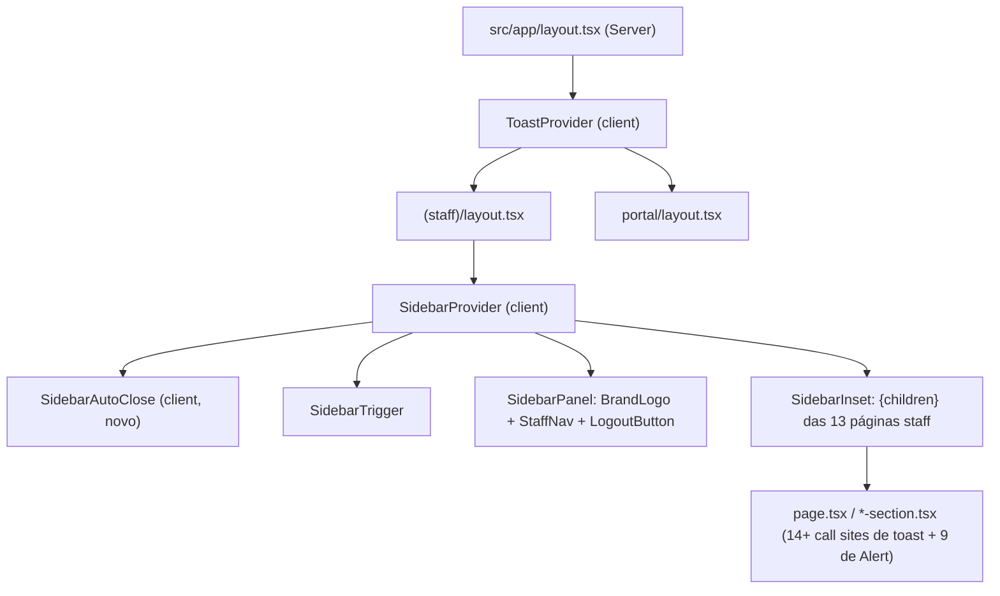

# Adoção `@still-void/ui@3.3.0` — Design

**Spec**: `.specs/features/still-void-v3.3-adoption/spec.md`
**Status**: Draft

---

## Decisões ativas conferidas (`.specs/STATE.md`)

- **AD-014** (port, não redesign): design conforma — nenhum primitivo além de `SidebarProvider`/`SidebarPanel`/`SidebarTrigger`/`SidebarInset`, `ToastProvider`/`useToast`, `Alert variant` é introduzido.
- **AD-005** (gate `sv-gap`): esta rodada só FECHA gaps existentes — nenhum `sv-gap:` novo é criado. `docs/still-void-gaps.md` não precisa de edição (nenhuma das 3 capacidades tinha marcação lá — elas eram gaps do documento de auditoria separado, não do gate).
- **AD-006** (token bridge): nenhum novo uso de cor cru introduzido — `Alert variant` resolve cor internamente na lib.
- Nenhuma decisão ativa conflita com este design. Nenhum supersede necessário.

Lições confirmadas (`lessons.py list --status confirmed`): só L-011 (scanner externo vs. árvore real), fora do escopo desta feature — nada aplicável.

---

## Architecture Overview

Três mudanças independentes na árvore de componentes, sem overlap de arquivos entre si (exceto o root layout, que ganha só o Toast):



`SidebarProvider` só entra no layout do staff (é o único que tinha o `<Sidebar>` estático). `ToastProvider` entra uma vez no root — cobre staff e portal com uma fila só.

---

## Approach Exploration — onde/como montar o Sidebar

**Opção A (recomendada): substituição direta em `(staff)/layout.tsx`, mantendo-o Server Component.**
`SidebarProvider`/`SidebarPanel`/`SidebarTrigger`/`SidebarInset` são Client Components (`'use client'` na própria lib), mas um Server Component pode renderizá-los como filhos sem virar client ele mesmo (padrão App Router). `StaffLayout` continua Server Component; só o que está dentro vira client, exatamente como já acontece hoje com `<StaffNav>` (que já é `'use client'` dentro do mesmo layout server).
_Trade-off_: nenhum — é o padrão já em uso no arquivo.

**Opção B: criar um wrapper `<StaffShell>` client-only separado, importado pelo layout.**
Isolaria toda a lógica de sidebar num componente próprio, testável isoladamente.
_Trade-off_: indireção extra sem ganho — o layout já é pequeno (28 linhas), extrair um componente só pra ele não muda nada de testabilidade (os componentes internos já são testáveis via RTL sem precisar do layout).

**Opção C: manter `<Sidebar>` estático e só adicionar CSS responsivo (esconder em mobile via media query, sem drawer).**
Mais barato, mas não resolve o requisito real — sem drawer, o usuário mobile perde acesso à navegação inteiramente (sidebar escondida = sem link nenhum). Rejeitada: viola AC P1-2/3 da spec (drawer funcional).

**Escolha: Opção A.**

---

## Code Reuse Analysis

### Existing Components to Leverage

| Component | Location | How to Use |
|---|---|---|
| `SidebarProvider`/`SidebarPanel`/`SidebarTrigger`/`SidebarInset` | `@still-void/ui/react/client` | Import direto, substitui `<Sidebar>`/`<SidebarSection>` de `@still-void/ui/react` |
| `ToastProvider`/`useToast` | `@still-void/ui/react/client` | Import direto |
| `Alert`/`AlertDescription`/`AlertTitle` | `@still-void/ui/react` (já em uso) | Só adiciona prop `variant`, sem trocar import |
| `apiFetch` | `@/lib/client` | Já usado em todos os 32 call sites — nenhuma mudança de contrato, só envolve com toast/try-catch |
| `BrandLogo`, `LogoutButton`, `StaffNav` | `src/components/`, `(staff)/staff-nav.tsx` | Movem de dentro de `<Sidebar>` pra dentro de `<SidebarPanel>`, sem mudança de props |

### Integration Points

| System | Integration Method |
|---|---|
| Next.js App Router (Server/Client boundary) | `RootLayout` e `StaffLayout` continuam Server Components; só os novos providers e o `SidebarAutoClose` (abaixo) são `'use client'`, igual ao padrão já usado por `StaffNav` |
| Tailwind `@theme` (breakpoint) | Nenhuma mudança de token — `lg:` do Tailwind (1024px) e o breakpoint default do `SidebarProvider` (1024px, não sobrescrito) já coincidem. Ver Risco R1. |

---

## Components

### `SidebarAutoClose` (novo, pequeno)

- **Purpose**: fechar o drawer mobile automaticamente quando a rota muda (navegação via `StaffNav`), porque `SidebarPanel` não faz isso sozinho — o `Dialog.Root` só fecha por interação direta (trigger/overlay/Esc), não por mudança de `usePathname()`.
- **Location**: `src/app/(staff)/sidebar-auto-close.tsx` (novo arquivo, ~15 linhas)
- **Interfaces**: nenhuma prop — componente sem filhos, só efeito colateral. Renderiza `null`.
- **Dependencies**: `useSidebar()` (de `@still-void/ui/react/client`), `usePathname()` (de `next/navigation`)
- **Reuses**: nada externo — é puramente o `useEffect` de fechar em troca de pathname, com guarda pra não fechar no mount inicial (senão fecharia um drawer que já nasceu fechado, sem efeito observável, mas evita um `setOpen` supérfluo)
- **Implementação**:
  ```tsx
  "use client";
  import { useEffect, useRef } from "react";
  import { usePathname } from "next/navigation";
  import { useSidebar } from "@still-void/ui/react/client";

  export function SidebarAutoClose() {
    const pathname = usePathname();
    const { setOpen } = useSidebar();
    const isFirstRender = useRef(true);

    useEffect(() => {
      if (isFirstRender.current) {
        isFirstRender.current = false;
        return;
      }
      setOpen(false);
    }, [pathname, setOpen]);

    return null;
  }
  ```
  Montado como filho direto de `SidebarProvider` (precisa estar dentro pra `useSidebar()` funcionar), fora de `SidebarPanel`/`SidebarInset` — não renderiza nada visível.

### `StaffLayout` (edição)

- **Purpose**: mesmo de hoje — casca da área staff.
- **Location**: `src/app/(staff)/layout.tsx`
- **Mudança**: `<Sidebar className="w-56 ...">` → `<SidebarProvider><SidebarAutoClose /><SidebarPanel className="w-56 ...">...</SidebarPanel><SidebarInset>{children}</SidebarInset></SidebarProvider>`. Ver template completo abaixo.
- **Dependencies**: `@still-void/ui/react/client` (novo import), `./sidebar-auto-close` (novo)
- **Reuses**: `BrandLogo`, `LogoutButton`, `StaffNav` sem alteração de props

**Trigger mobile**: `SidebarPanel` (rail acima do breakpoint) não tem header próprio — precisa de uma barra visível só abaixo do breakpoint com o `SidebarTrigger`, porque sem ela o usuário mobile não tem como abrir o drawer. Baseado no Storybook `AppSidebar.stories.tsx` (WithHeaderTrigger, corrigido no round-5) que usa o mesmo padrão: trigger dentro do `SidebarInset`, antes do conteúdo, escondido acima do breakpoint via `lg:hidden` (1024px, coincide com o breakpoint default do provider — Risco R1).

```tsx
"use client";
// layout.tsx precisa virar client? NÃO — só os filhos client-only. StaffLayout
// continua Server Component (sem "use client" no topo do arquivo).

import { SidebarProvider, SidebarPanel, SidebarTrigger, SidebarInset } from "@still-void/ui/react/client";
import { SidebarSection } from "@still-void/ui/react";
import { BrandLogo } from "@/components/brand-logo";
import { LogoutButton } from "@/components/logout-button";
import { StaffNav } from "./staff-nav";
import { SidebarAutoClose } from "./sidebar-auto-close";

export default function StaffLayout({ children }: { children: React.ReactNode }) {
  return (
    <SidebarProvider>
      <SidebarAutoClose />
      <div className="flex min-h-screen">
        <SidebarPanel className="w-56 shrink-0 justify-between border-r border-border p-5" title="Navegação">
          <div className="flex flex-col gap-8">
            <div>
              <BrandLogo />
              <p className="mt-1 text-xs text-ink-3">Clínica de Estomaterapia</p>
            </div>
            <SidebarSection title="Navegação">
              <StaffNav />
            </SidebarSection>
          </div>
          <LogoutButton />
        </SidebarPanel>
        <SidebarInset className="flex-1 p-6 lg:p-8">
          <div className="mb-4 flex items-center gap-3 lg:hidden">
            <SidebarTrigger />
            <BrandLogo />
          </div>
          {children}
        </SidebarInset>
      </div>
    </SidebarProvider>
  );
}
```

Notas sobre o template acima (a confirmar durante Execute, contra o `.d.ts` real da lib — Knowledge Verification Chain step 1 já rodado no round-5, mas confirmar props exatas antes de codar):
- `SidebarPanel` aceita `title` (usado como `Dialog.Title` sr-only no modo drawer) e `className`/`...props` de `ComponentPropsWithoutRef<'aside'>` — a `className` com `w-56 shrink-0 ...` é aplicada tanto no rail quanto (via `cn`) no drawer; **checar se `w-56` faz sentido no drawer** (a lib estiliza `.sv-app-sidebar__drawer` com `position: fixed; inset: 0`, então a largura pode precisar de ajuste ou pode já ser sobrescrita pela classe da lib — verificar visualmente).
- O `<div className="flex min-h-screen">` externo pode ser redundante já que `.sv-app-shell` (classe que `SidebarProvider` aplica) já é `display: flex` — **remover o `<div>` extra e aplicar `min-h-screen` diretamente via className no próprio `SidebarProvider` se a lib aceitar, ou manter o wrapper só se `SidebarProvider` não expuser `className`** (checar `SidebarProviderProps` — pelo `.d.ts` visto no round-5, `SidebarProvider` NÃO tem `className` na interface; então o wrapper `<div>` continua necessário, mas revisar se precisa do `flex` já que o `.sv-app-shell` interno já fornece).
- `overflow-x-hidden` do `<main>` original: REMOVER — é a causa da amputação (AC P1-6). `SidebarInset` renderiza `<main>` com `min-width: 0` já no CSS da lib (round-5, `.sv-app-sidebar-inset { min-width: 0 }`), que é o mecanismo correto pra conter overflow sem cortar.

### Alert call sites (P2) — sem componente novo, só edição de 6 arquivos

Nenhuma interface nova — cada ponto troca `className` manual por `variant`. Ver tabela de ACs na spec (P2-1 a P2-9) para o mapeamento completo arquivo→variante.

### Toast call sites (P3) — sem componente novo além do provider

`useToast()` chamado direto dentro dos 13 arquivos client já existentes. Padrão por call site:

```tsx
// dentro do componente, já "use client"
const { toast } = useToast();

// no catch existente ou novo:
} catch (err) {
  toast({ description: err instanceof Error ? err.message : "<fallback existente>", variant: "danger" });
  // ... setError/setActionError existente PERMANECE (AC P3-35)
}

// após sucesso:
toast({ description: "<texto da tabela da spec>", variant: "success" });
```

---

## Data Models

Nenhum — feature é puramente de UI/apresentação, sem mudança de schema, DTO ou endpoint.

---

## Error Handling Strategy

| Error Scenario | Handling | User Impact |
|---|---|---|
| `resolveFollowUp` sem catch hoje (unhandled rejection) | Adicionar `try/catch`, toast `danger` no catch | Antes: nada (erro silencioso). Depois: toast visível |
| `agenda handleCreate` (consulta única) sem catch | Adicionar `try/catch` só no ramo `else` (consulta única) — o ramo de série (`if (values.occurrences > 1)`) mantém o `seriesNotice` como está, fora de escopo (spec Out of Scope) | Erro de criar consulta única agora visível; erro de série continua propagando sem tratamento novo (não regride, também não melhora — fora de escopo) |
| `faturamento handleCreate` sem catch | Adicionar `try/catch`, toast `danger` | Idem `resolveFollowUp` |
| Demais 29 call sites | Já têm `catch` — só adiciona a chamada de `toast()` dentro do bloco existente (sucesso e/ou erro), sem mudar a lógica de tratamento | Erro que já aparecia em `Alert`/`setActionError` continua aparecendo ali; toast é aditivo |

---

## Risks & Concerns

| Concern | Location | Impact | Mitigation |
|---|---|---|---|
| **R1**: breakpoint duplicado em duas fontes independentes (Tailwind `lg:` = 1024px via config do Tailwind, `SidebarProvider` default = 1024px via JS/matchMedia) | `(staff)/layout.tsx` (novo), `tailwind` config | Se um dia o breakpoint do Tailwind mudar (`lg` deixa de ser 1024px) sem atualizar o `breakpoint` prop do `SidebarProvider`, o trigger mobile (`lg:hidden`) e o rail/drawer da lib dessincronizam — trigger pode sumir com o rail ainda em modo drawer, ou aparecer com o rail já em modo desktop | Documentar o acoplamento no comentário do JSX (feito no template acima); se o breakpoint do Tailwind mudar no futuro, passar `breakpoint={<valor>}` explícito ao `SidebarProvider` no mesmo commit |
| **R2**: `SidebarPanel` não tem exemplo testado no app real com `w-56` fixo — o round-5 só validou a lib isoladamente (Storybook/testes unitários), não dentro do VittaFlow | `(staff)/layout.tsx` | Layout pode ficar visualmente diferente do `<Sidebar>` estático atual (largura do drawer, padding) | Validação manual em viewport 390/768/1024/1280px como parte da task de Sidebar, antes de considerar a task fechada (não é só "compila e os testes passam") |
| **R3**: 14 write-paths do prontuário concentrados em 5 arquivos grandes (`care-plans-section.tsx` sozinho tem 7) — risco de edição colidir/gerar diffs grandes se paralelizado descuidadamente | `pacientes/[id]/*.tsx` | Dois workers tocando o mesmo arquivo em paralelo (mesmo diretório de trabalho) já causou colisão de commit nesta sessão (round-5, still-void-ui) | Tasks phase agrupa por ARQUIVO, nunca dois workers no mesmo arquivo ao mesmo tempo; fase de Toast é sequencial entre arquivos que se repetem (nenhum arquivo aparece em duas tasks paralelas) |
| **R4**: `err instanceof Error ? err.message : "<fallback>"` — mensagens de erro de servidor podem conter texto técnico não traduzido (dependendo do endpoint) | todos os 32 call sites | Toast de erro pode mostrar mensagem em inglês ou stack-like se a API retornar isso | Fora de escopo desta feature (mensagens de erro já são assim hoje nos `Alert`/`setActionError` existentes — comportamento preservado, não introduzido) |

> Nenhum risco de segurança, performance ou schema — feature é só apresentação sobre fluxos de escrita já existentes e testados.

---

## Tech Decisions

| Decision | Choice | Rationale |
|---|---|---|
| `SidebarAutoClose` como componente próprio vs. inline no layout | Componente próprio, arquivo dedicado | `useSidebar()` só funciona DENTRO do `SidebarProvider` — não pode ficar no mesmo nível do `<SidebarProvider>` que o instancia; extrair evita um wrapper adicional só pra isso |
| Onde adicionar toast: dentro do `catch` existente vs. bloco novo | Reaproveitar o `catch` existente sempre que ele já existir (29/32 sites) | Menor diff, menor risco de mudar comportamento de erro já testado |
| Ordem de execução das 3 stories | Sidebar → Alert → Toast (ordem da spec, que já é a ordem de prioridade da auditoria) | Sidebar é pré-requisito de fato pra qualquer teste manual em mobile das outras duas; Alert é mais simples/isolado que Toast (sem provider novo), fecha rápido antes do Toast tocar os mesmos 13 arquivos que o Alert já tocou em 6 deles — reduz conflito de diff no mesmo arquivo entre stories |
